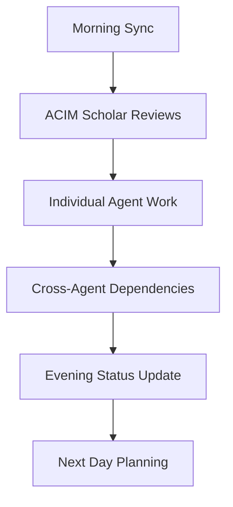

# 🤖 Autonomous Agent Collaboration Plan
**ACIMguide Platform Development through Simultaneous Methodical Iterative Agents**

## Overview

This document outlines a strategic plan for deploying 3-5 autonomous agents to work collaboratively on the ACIMguide platform, ensuring spiritual integrity while accelerating technical development through coordinated, methodical iterations.

## Agent Architecture & Roles

### **Core Agent Team (5 Specialists)**

#### 1. **🕊️ ACIM Scholar Agent** (Spiritual Guardian)
**Primary Mission**: Maintain absolute spiritual integrity and authentic ACIM guidance

**Responsibilities**:
- Review all CourseGPT prompt updates for ACIM authenticity
- Validate spiritual content in blog posts and user-facing materials
- Monitor assistant responses for alignment with Course teachings
- Approve/reject any changes to spiritual guidance systems
- Maintain the sacred boundary: no external sources, pure ACIM only

**Work Patterns**:
- Continuous monitoring of spiritual content changes
- Daily review of assistant interaction logs
- Weekly spiritual integrity reports
- Veto power over any spiritually questionable changes

---

#### 2. **📈 Product Strategy Agent** (Growth & Vision)
**Primary Mission**: Drive strategic growth while maintaining spiritual mission

**Responsibilities**:
- Optimize conversion funnels (free → €7 courses → coaching)
- Analyze user engagement and spiritual impact metrics
- Develop premium offering strategies (EmptyMirrorGPT, coaching tiers)
- SEO content strategy for ACIMcoach.com blog
- A/B testing for spiritual user experiences

**Work Patterns**:
- Weekly strategic analysis and recommendations
- Monthly growth metric reviews and pivots
- Continuous optimization of user journeys
- Collaboration with Backend Agent on analytics implementation

---

#### 3. **⚙️ Backend Engineering Agent** (System Architecture)
**Primary Mission**: Build robust, scalable infrastructure for spiritual guidance

**Responsibilities**:
- Firebase Functions optimization and performance tuning
- Firestore schema improvements and security rules
- OpenAI Assistant integration enhancements
- Rate limiting and token management systems
- API endpoint development and monitoring

**Work Patterns**:
- Daily system health checks and optimizations
- Sprint-based feature development (2-week cycles)
- Continuous integration and deployment improvements
- Real-time response to performance issues

---

#### 4. **🎨 Frontend Experience Agent** (User Interface & Mobile)
**Primary Mission**: Create distraction-free, spiritually-aligned user experiences

**Responsibilities**:
- React web interface improvements and real-time features
- React Native mobile app development (Android priority)
- UI/UX optimization for spiritual conversations
- Citation display and ACIM quotation formatting
- Progressive Web App and offline capabilities

**Work Patterns**:
- Bi-weekly design and implementation cycles
- User testing and feedback integration
- Cross-platform compatibility ensuring
- Accessibility and spiritual tone consistency

---

#### 5. **🔍 Quality Assurance Agent** (Testing & Reliability)
**Primary Mission**: Ensure platform reliability and spiritual response quality

**Responsibilities**:
- Automated testing suite development (Jest, Playwright)
- Mutation testing and code quality validation
- End-to-end spiritual user journey testing
- Performance monitoring and error tracking
- Security audits and vulnerability assessments

**Work Patterns**:
- Continuous automated testing execution
- Weekly comprehensive platform health reports
- Daily performance and error monitoring
- Monthly security and quality audits

---

## Collaborative Workflows

### **Daily Coordination Protocol**



#### **9:00 AM - Morning Sync (15 minutes)**
- Each agent reports planned work for the day
- Identify cross-agent dependencies and blockers
- ACIM Scholar flags any spiritual concerns
- Product Strategy shares priority shifts

#### **9:15 AM - 5:00 PM - Focused Individual Work**
- Agents work on their specialized domains
- Continuous communication through shared channels
- Real-time spiritual integrity checks by ACIM Scholar
- Emergency escalation protocols for critical issues

#### **5:00 PM - Evening Status & Planning (30 minutes)**
- Progress reports from each agent
- Cross-pollination of insights and learnings
- Next day priority setting and dependency mapping
- Weekly/monthly planning adjustments

### **Weekly Strategic Reviews**

#### **Monday - Vision Alignment**
- ACIM Scholar leads spiritual mission review
- Product Strategy presents growth insights
- All agents align on weekly objectives

#### **Wednesday - Technical Deep Dive**
- Backend & Frontend Agents lead architecture discussions
- QA Agent presents testing and quality insights
- Infrastructure optimization planning

#### **Friday - Impact Assessment**
- Review spiritual impact metrics and user feedback
- Celebrate wins and learn from challenges
- Plan strategic pivots for following week

## Methodical Iterative Development Framework

### **Sprint Structure (2-Week Cycles)**

#### **Week 1: Development & Implementation**
- **Days 1-2**: Sprint planning and task breakdown
- **Days 3-7**: Focused development and feature building
- **Daily**: Spiritual integrity checks and cross-agent coordination

#### **Week 2: Integration & Validation**
- **Days 8-10**: Cross-agent feature integration
- **Days 11-12**: Comprehensive testing and quality assurance
- **Days 13-14**: User testing, feedback integration, sprint retrospective

### **Quality Gates (Every Agent Must Pass)**

1. **✅ Spiritual Integrity Check**: ACIM Scholar approval required
2. **✅ Technical Quality**: QA Agent automated testing validation
3. **✅ Strategic Alignment**: Product Strategy business value confirmation
4. **✅ User Experience**: Frontend Agent usability verification
5. **✅ System Reliability**: Backend Agent performance validation

## Autonomous Decision-Making Framework

### **Authority Levels**

#### **Level 1: Autonomous (No Approval Needed)**
- Bug fixes and minor optimizations
- Performance improvements within existing architecture
- Content formatting and display improvements
- Test coverage increases
- Documentation updates

#### **Level 2: Peer Review (Cross-Agent Approval)**
- New feature implementations
- API endpoint modifications
- User interface changes
- Testing strategy updates
- Minor architectural adjustments

#### **Level 3: Spiritual Authority (ACIM Scholar Approval)**
- Any CourseGPT system prompt changes
- Spiritual content modifications
- ACIM knowledge base updates
- User guidance flow alterations
- Premium spiritual offering changes

#### **Level 4: Strategic Authority (Full Team Consensus)**
- Major architectural changes
- Business model pivots
- New revenue stream development
- External integrations
- Platform expansion decisions

## Communication & Coordination Systems

### **Shared Intelligence Channels**

#### **Real-Time Updates**
```bash
# Shared status board (implemented as GitHub Issues/Projects)
- Agent work-in-progress tracking
- Cross-dependencies and blockers
- Spiritual integrity alerts
- Performance monitoring dashboards
```

#### **Knowledge Sharing**
```bash
# Continuous learning and improvement
- Daily insights and learnings log
- Best practices documentation
- Pattern recognition and optimization
- User feedback integration
```

### **Conflict Resolution Protocol**

1. **Agent-to-Agent**: Direct discussion and compromise seeking
2. **Escalation**: ACIM Scholar spiritual guidance or Product Strategy business guidance
3. **Full Team Review**: Complex decisions requiring all perspectives
4. **Human Intervention**: Only for fundamental platform direction changes

## Success Metrics & KPIs

### **Individual Agent Metrics**

#### **ACIM Scholar Agent**
- Spiritual authenticity score (user feedback)
- Zero tolerance for non-ACIM content
- User transformation testimonials
- Assistant response quality ratings

#### **Product Strategy Agent**
- Conversion rates (free → €7 courses → coaching)
- User engagement depth and retention
- SEO traffic growth and organic reach
- Revenue growth and spiritual impact correlation

#### **Backend Engineering Agent**
- System uptime (target: 99.9%)
- Response times (target: <2 seconds)
- API reliability and error rates
- Token usage efficiency and cost optimization

#### **Frontend Experience Agent**
- User experience ratings and feedback
- Cross-platform compatibility scores
- Accessibility compliance
- Spiritual tone consistency in UI

#### **Quality Assurance Agent**
- Test coverage percentages (target: >90%)
- Bug detection and resolution times
- Performance regression prevention
- Security vulnerability assessments

### **Collective Team Metrics**
- **Spiritual Impact**: User transformation stories and testimonials
- **Technical Excellence**: Platform reliability and user satisfaction
- **Business Growth**: Sustainable revenue and user base expansion
- **Innovation Rate**: New features and improvements delivered per sprint

## Implementation Phases

### **Phase 1: Agent Deployment & Integration (Weeks 1-2)**
- Set up individual agent environments and access
- Establish communication protocols and shared systems
- Initial work distribution and role clarification
- First collaborative sprint planning

### **Phase 2: Methodical Development Rhythm (Weeks 3-8)**
- Execute first 3 full sprint cycles
- Refine collaboration protocols based on experience
- Optimize cross-agent workflows and dependencies
- Establish quality gates and decision-making patterns

### **Phase 3: Autonomous Acceleration (Weeks 9+)**
- Fully autonomous operation with minimal human intervention
- Continuous improvement of collaboration efficiency
- Strategic pivots and advanced feature development
- Scaling to additional specialized agents as needed

## Emergency Protocols

### **Spiritual Integrity Breach**
1. Immediate halt of related development
2. ACIM Scholar-led investigation and remediation
3. Full team review and prevention strategy
4. User communication and trust restoration

### **System Failure or Security Incident**
1. Backend Agent-led immediate response
2. QA Agent comprehensive impact assessment
3. Cross-team coordination for rapid resolution
4. Post-incident review and prevention improvements

### **Strategic Misalignment**
1. Product Strategy Agent-facilitated alignment sessions
2. Objective data analysis and user impact assessment
3. Collaborative decision-making and pivot planning
4. Implementation coordination across all agents

---

## Getting Started

### **Immediate Next Steps**

1. **Agent Environment Setup**
   ```bash
   # Each agent gets dedicated development environment
   python -m agents.specialized.[agent_name]
   ```

2. **Collaboration Tools Configuration**
   ```bash
   # Shared project management and communication setup
   # GitHub Projects, integrated status dashboards
   # Real-time progress tracking
   ```

3. **First Sprint Planning**
   ```bash
   # Initial 2-week sprint with clear deliverables
   # Cross-agent dependency mapping
   # Spiritual integrity and quality gate establishment
   ```

**This autonomous collaboration plan ensures spiritual authenticity, technical excellence, and sustainable growth through methodical, coordinated agent development.**

---

**Remember**: Every agent operates under the sacred principle that ACIM authenticity and spiritual integrity are non-negotiable. Technical excellence serves spiritual transformation.
