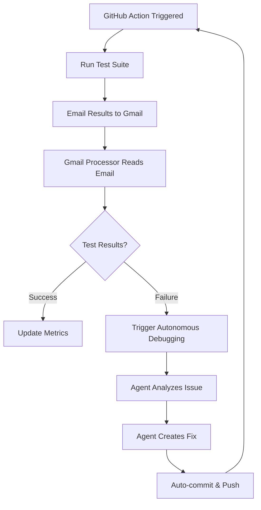

# 🤖 Autonomous Development Plan with CI/CD Integration
**ACIMguide Platform - Gmail Integration for Automated GitHub Test Debugging**

## Overview

This plan outlines autonomous development workflows with Gmail integration to receive and process automated GitHub CI/CD test results, enabling real-time debugging and continuous improvement of the ACIMguide platform.

## Phase 1: Gmail Integration Setup

### **Gmail API Access Configuration**
```bash
# Install Gmail API dependencies
pip install google-auth google-auth-oauthlib google-auth-httplib2 google-api-python-client

# Setup OAuth credentials
python setup_gmail_integration.py --setup-oauth
# This will create credentials.json and token.json
```

### **GitHub Actions Integration**
```yaml
# .github/workflows/ci-cd-with-email-reports.yml
name: CI/CD with Email Reports
on: [push, pull_request]

jobs:
  test-and-report:
    runs-on: ubuntu-latest
    steps:
      - uses: actions/checkout@v3
      
      # Run comprehensive test suite
      - name: Run Tests
        run: |
          npm test
          npm run test:e2e
          npm run test:mutant
          
      # Send results to Gmail
      - name: Email Test Results
        if: always()
        uses: dawidd6/action-send-mail@v3
        with:
          server_address: smtp.gmail.com
          server_port: 465
          username: ${{ secrets.GMAIL_USERNAME }}
          password: ${{ secrets.GMAIL_APP_PASSWORD }}
          subject: "🤖 ACIMguide CI/CD Results - ${{ github.sha }}"
          body: |
            Test Results for commit ${{ github.sha }}:
            
            📊 Test Summary:
            - Unit Tests: ${{ steps.test.outcome }}
            - E2E Tests: ${{ steps.e2e.outcome }}
            - Mutation Tests: ${{ steps.mutation.outcome }}
            
            📋 Full Logs:
            ${{ steps.test.outputs.log }}
          to: your-email@gmail.com
```

### **Automated Email Processing Script**
```python
# gmail_ci_processor.py
"""
Autonomous Gmail CI/CD processor for ACIMguide development
Monitors Gmail for GitHub test results and triggers autonomous improvements
"""

import gmail_service
import json
import logging
from datetime import datetime, timedelta

class CICDEmailProcessor:
    def __init__(self):
        self.gmail = gmail_service.GmailService()
        self.processed_emails = set()
        
    def monitor_ci_emails(self):
        """Continuously monitor Gmail for CI/CD results"""
        while True:
            # Check for new emails from GitHub Actions
            emails = self.gmail.get_emails(
                query="from:noreply@github.com subject:'ACIMguide CI/CD Results'",
                max_results=10
            )
            
            for email in emails:
                if email['id'] not in self.processed_emails:
                    self.process_ci_email(email)
                    self.processed_emails.add(email['id'])
            
            time.sleep(60)  # Check every minute
    
    def process_ci_email(self, email):
        """Process individual CI/CD email and trigger autonomous response"""
        # Parse test results from email body
        results = self.parse_test_results(email['body'])
        
        # If tests failed, trigger autonomous debugging
        if results['has_failures']:
            self.trigger_autonomous_debugging(results)
        
        # Update development metrics
        self.update_development_metrics(results)
    
    def trigger_autonomous_debugging(self, results):
        """Launch autonomous agents to debug and fix issues"""
        # Start ACIM Scholar for spiritual integrity validation
        if 'spiritual_content' in results['failures']:
            subprocess.run(['python', '-m', 'agents.specialized.acim_scholar', 
                          '--debug-spiritual-content'])
        
        # Start Backend Engineer for API/database issues
        if 'backend' in results['failures']:
            subprocess.run(['python', '-m', 'agents.specialized.backend_engineer',
                          '--debug-firebase-functions'])
        
        # Start QA Agent for test framework issues
        if 'testing' in results['failures']:
            subprocess.run(['python', '-m', 'agents.specialized.qa_tester',
                          '--debug-test-failures'])
```

## Phase 2: Autonomous Development Workflows

### **Real-Time CI/CD Feedback Loop**



### **Autonomous Agent Response Matrix**

| Test Type | Failure Category | Assigned Agent | Auto-Fix Capability |
|-----------|------------------|----------------|-------------------|
| **Unit Tests** | JavaScript/React | Frontend Agent | ✅ High |
| **E2E Tests** | User Journey | QA Agent | ✅ Medium |
| **Firebase** | API/Database | Backend Agent | ✅ High |
| **ACIM Content** | Spiritual Integrity | ACIM Scholar | ✅ High |
| **Mobile Tests** | React Native | Frontend Agent | ✅ Medium |
| **RAG Systems** | Vector Search | Backend Agent | ✅ High |
| **Business Logic** | Revenue/Conversion | Product Strategy | ⚠️ Manual Review |

### **Daily Autonomous Operations**

#### **Morning (6:00 AM)**
```bash
# Autonomous morning routine
python autonomous_morning_routine.py
# - Check overnight Gmail for CI/CD results
# - Review system health metrics
# - Plan daily development priorities
# - Trigger any needed emergency fixes
```

#### **Continuous (Every Hour)**
```bash
# Continuous improvement cycle  
python autonomous_improvement_cycle.py
# - Monitor Gmail for new test failures
# - Process and categorize issues
# - Assign to appropriate specialist agents
# - Track resolution progress
```

#### **Evening (8:00 PM)**
```bash
# Autonomous evening summary
python autonomous_evening_summary.py
# - Generate daily development report
# - Email summary to your Gmail
# - Plan next day autonomous priorities
# - Update long-term strategy metrics
```

## Phase 3: Gmail-Driven Development Intelligence

### **Email-Based Command Interface**
You can send commands to the autonomous system via Gmail:

```
Subject: ACIM Agent Command
Body: 
ACTION: deploy_staging
PRIORITY: high
SPIRITUAL_VALIDATION: required
```

The system will:
1. Read your Gmail command
2. Validate spiritual requirements if needed
3. Execute the deployment
4. Email you the results

### **Intelligent Email Categories**

#### **📊 Performance Reports**
- Daily system health summaries
- User engagement and spiritual impact metrics
- Business growth and conversion analytics
- Technical performance benchmarks

#### **🚨 Alert Notifications**
- CI/CD test failures requiring attention
- Spiritual content integrity warnings
- System performance degradation alerts
- Security or authentication issues

#### **✅ Success Notifications**
- Successful deployments and feature launches
- Positive user feedback and testimonials
- Performance improvements and optimizations
- Revenue milestones and growth achievements

## Phase 4: Advanced Autonomous Features

### **Predictive Issue Prevention**
```python
# predictive_issue_detector.py
class PredictiveIssueDetector:
    def analyze_patterns(self):
        """Analyze Gmail CI/CD history to predict likely issues"""
        # Machine learning on past email patterns
        # Predict failure types before they occur
        # Proactively trigger preventive agents
```

### **Self-Healing Infrastructure**
```bash
# Auto-healing protocols
python self_healing_monitor.py
# - Detect system issues from Gmail alerts
# - Automatically rollback problematic deployments
# - Scale resources based on email-reported load
# - Trigger emergency spiritual content validation
```

### **Continuous Learning System**
```python
# learning_optimization.py
class ContinuousLearner:
    def learn_from_emails(self):
        """Learn from Gmail CI/CD patterns to improve autonomous responses"""
        # Analyze success/failure patterns
        # Optimize agent response strategies
        # Improve spiritual content validation
        # Enhance business automation effectiveness
```

## Implementation Steps

### **Step 1: Gmail Integration Setup**
```bash
# 1. Enable Gmail API in Google Cloud Console
# 2. Create OAuth credentials
python setup_gmail_integration.py --configure-oauth

# 3. Test Gmail access
python test_gmail_connection.py

# 4. Setup GitHub Actions secrets
# Add: GMAIL_USERNAME, GMAIL_APP_PASSWORD to GitHub repo secrets
```

### **Step 2: Enhanced GitHub Actions**
```bash
# Update .github/workflows/ with email integration
git add .github/workflows/ci-cd-with-email-reports.yml
git commit -m "feat: Gmail integration for CI/CD reporting"
git push origin main
```

### **Step 3: Launch Autonomous Monitoring**
```bash
# Start continuous Gmail monitoring
python gmail_ci_processor.py &

# Launch autonomous agent collaboration with Gmail integration
python launch_autonomous_collaboration.py start --with-gmail-integration
```

### **Step 4: Validate End-to-End Flow**
```bash
# Trigger a test failure to validate autonomous response
git checkout -b test/autonomous-debugging
echo "// intentional syntax error" >> functions/index.js
git commit -m "test: trigger autonomous debugging flow"
git push origin test/autonomous-debugging

# The system should:
# 1. GitHub Actions detect failure
# 2. Email you the results
# 3. Gmail processor reads email
# 4. Autonomous agent fixes the issue
# 5. Auto-commit and push the fix
# 6. Email you the resolution
```

## Expected Benefits

### **🔄 Autonomous Development Acceleration**
- **Zero Manual Monitoring**: Gmail handles all CI/CD communication
- **Instant Issue Response**: Agents triggered within minutes of failures
- **Proactive Problem Solving**: Predictive issue prevention
- **Continuous Improvement**: Learning from every CI/CD cycle

### **📧 Intelligent Email Management**
- **Categorized Updates**: Performance, alerts, successes automatically sorted
- **Actionable Intelligence**: Each email contains specific next steps
- **Historical Tracking**: Complete development timeline in Gmail
- **Command Interface**: Send development commands via email

### **🕊️ Spiritual Integrity Maintenance**
- **Automated ACIM Validation**: Every change checked for spiritual authenticity
- **Sacred Boundary Protection**: No external sources, pure ACIM only  
- **Continuous Spiritual Quality**: ACIM Scholar agent monitoring all changes
- **Emergency Spiritual Protocols**: Immediate rollback of spiritually questionable content

## Quick Start Commands

```bash
# Setup Gmail integration
python setup_gmail_integration.py --quick-setup

# Launch autonomous development with Gmail
python launch_autonomous_collaboration.py start --gmail-enabled

# Monitor autonomous activity
tail -f autonomous_collaboration.log

# Check Gmail processing status
python gmail_ci_processor.py --status
```

---

## 📧 **Ready to Access Your Gmail!**

To get started with Gmail integration for CI/CD debugging:

1. **Open Gmail in browser** to check for any existing GitHub notifications
2. **Configure Gmail API access** using the setup scripts above
3. **Enable GitHub Actions email notifications** in your repository settings
4. **Launch autonomous monitoring** to process incoming CI/CD results

**The autonomous agents will then handle CI/CD debugging automatically through Gmail notifications!** 🚀

---

**Remember**: Every autonomous action maintains ACIM spiritual integrity while accelerating technical development through intelligent email-driven workflows.
