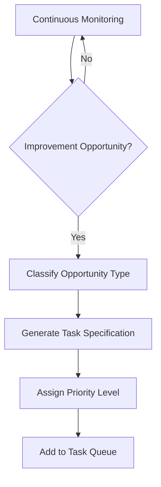
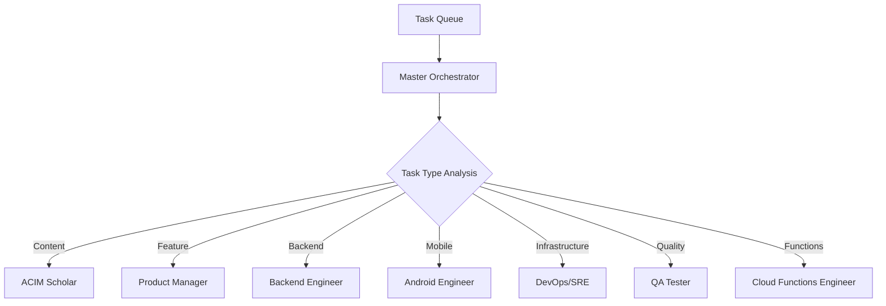

# ACIMguide Autonomous Improvement Pipeline
*A Multi-Agent Orchestration System for Continuous Enhancement*

## 🎯 **Executive Summary**

This document defines a completely autonomous improvement pipeline for the ACIMguide project using multi-agent orchestration. The system leverages specialized AI agents working in harmony to continuously enhance the platform while maintaining strict adherence to ACIM doctrinal purity and technical excellence.

## 🏗️ **Architecture Overview**

```
Autonomous Improvement Pipeline Architecture
├── Orchestration Layer
│   ├── Master Orchestrator (Task Distribution & Coordination)
│   ├── Task Queue Management (Priority-based Execution)
│   └── Inter-Agent Communication Protocol
│
├── Specialized Agent Roles
│   ├── ACIM Scholar (Doctrinal Guardian)
│   ├── Product Manager (Strategic Planning)
│   ├── Backend Engineer (API & Database)
│   ├── Android Engineer (Mobile Development)
│   ├── DevOps/SRE (Infrastructure & Security)
│   ├── QA Tester (Quality Assurance)
│   └── Cloud Functions Engineer (Serverless Logic)
│
├── Monitoring & Feedback Layer
│   ├── Performance Analytics
│   ├── User Experience Metrics
│   ├── Doctrinal Compliance Monitoring
│   └── Cost & Resource Optimization
│
└── Continuous Learning Layer
    ├── Pattern Recognition
    ├── Improvement Opportunity Detection
    └── Autonomous Task Generation
```

## 🤖 **Agent Roles & Responsibilities**

### **1. Master Orchestrator**
**Role**: Central coordination and task distribution
**Responsibilities**:
- Parse incoming improvement opportunities
- Assign tasks to appropriate specialized agents
- Monitor cross-agent dependencies
- Resolve conflicts and ensure coherent execution
- Maintain project-wide consistency

### **2. ACIM Scholar (Doctrinal Guardian)**
**Role**: Spiritual integrity and theological accuracy
**Responsibilities**:
- Validate all content changes for ACIM fidelity
- Review AI responses for doctrinal accuracy
- Ensure exact text reproduction from Foundation for Inner Peace editions
- Prevent worldly advice contamination
- Maintain citation accuracy (T-1.I.1:1-5 format)

### **3. Product Manager**
**Role**: Strategic planning and user experience optimization
**Responsibilities**:
- Analyze user behavior patterns and pain points
- Generate feature specifications and user stories
- Prioritize improvement opportunities
- Create comprehensive product documentation
- Validate market fit and user value

### **4. Backend Engineer**
**Role**: API development and database optimization
**Responsibilities**:
- Optimize Firebase Cloud Functions performance
- Enhance OpenAI integration and response quality
- Improve database queries and data structure
- Implement new backend features
- Monitor and resolve API issues

### **5. Android Engineer**
**Role**: Mobile application development
**Responsibilities**:
- Develop native Android application features
- Optimize mobile performance and battery usage
- Implement offline functionality
- Enhance user interface and experience
- Ensure cross-device compatibility

### **6. DevOps/SRE Engineer**
**Role**: Infrastructure reliability and security
**Responsibilities**:
- Monitor system performance and uptime
- Optimize cloud costs and resource allocation
- Implement security enhancements
- Manage CI/CD pipeline improvements
- Ensure disaster recovery capabilities

### **7. QA Tester**
**Role**: Quality assurance and testing automation
**Responsibilities**:
- Execute comprehensive testing protocols
- Validate ACIM content integrity
- Test cross-platform compatibility
- Monitor performance benchmarks
- Ensure accessibility compliance

### **8. Cloud Functions Engineer**
**Role**: Serverless logic and integration
**Responsibilities**:
- Optimize Firebase Cloud Functions
- Implement real-time data synchronization
- Enhance search and retrieval algorithms
- Manage third-party integrations
- Monitor function performance and costs

## 🔄 **Autonomous Improvement Workflow**

### **Phase 1: Opportunity Detection**


**Triggers**:
- User feedback analysis
- Performance metric degradation
- Security vulnerability detection
- Cost optimization opportunities
- Feature usage pattern analysis
- Error rate threshold breaches

### **Phase 2: Task Orchestration**


### **Phase 3: Collaborative Execution**
1. **Task Assignment**: Master Orchestrator assigns tasks based on expertise
2. **Dependency Resolution**: Identify and sequence dependent tasks
3. **Parallel Execution**: Execute independent tasks simultaneously
4. **Cross-Agent Communication**: Share context and coordinate changes
5. **Quality Gates**: ACIM Scholar validates all content changes
6. **Testing Validation**: QA Tester verifies all implementations

### **Phase 4: Deployment & Monitoring**
1. **Automated Testing**: Comprehensive test suite execution
2. **Staging Deployment**: Deploy to staging environment
3. **Performance Validation**: Verify performance benchmarks
4. **Production Deployment**: Gradual rollout with monitoring
5. **Success Metrics**: Track improvement effectiveness
6. **Feedback Loop**: Generate insights for future improvements

## 📊 **Task Classification System**

### **Priority Levels**
- **P0 (Critical)**: Security vulnerabilities, ACIM content corruption, system outages
- **P1 (High)**: Performance degradation, user experience issues, cost overruns
- **P2 (Medium)**: Feature enhancements, optimization opportunities
- **P3 (Low)**: Nice-to-have improvements, experimental features

### **Task Categories**
- **Content**: ACIM text integrity, search accuracy, citation validation
- **Performance**: Speed optimization, resource efficiency, scalability
- **Security**: Vulnerability fixes, access control, data protection
- **Features**: New functionality, user experience enhancements
- **Infrastructure**: System reliability, cost optimization, monitoring
- **Quality**: Testing improvements, bug fixes, accessibility

## 🎯 **Autonomous Improvement Targets**

### **1. Content Quality & Accuracy**
- **Target**: 100% ACIM text fidelity
- **Metrics**: Citation accuracy, search precision, content validation
- **Agents**: ACIM Scholar, QA Tester
- **Automation**: Continuous content integrity monitoring

### **2. User Experience Excellence**
- **Target**: 4.8+ app store rating, <2s response time
- **Metrics**: User satisfaction, engagement, retention
- **Agents**: Product Manager, Android Engineer, Backend Engineer
- **Automation**: User behavior analysis and UX optimization

### **3. System Reliability & Performance**
- **Target**: 99.99% uptime, <100ms API response time
- **Metrics**: Availability, latency, error rates
- **Agents**: DevOps/SRE, Cloud Functions Engineer
- **Automation**: Performance monitoring and auto-scaling

### **4. Cost Optimization**
- **Target**: <$500/month operational costs
- **Metrics**: Cloud spend, resource utilization, efficiency ratios
- **Agents**: DevOps/SRE, Backend Engineer
- **Automation**: Cost monitoring and resource optimization

### **5. Security & Compliance**
- **Target**: Zero security vulnerabilities, full data protection
- **Metrics**: Security score, compliance status, audit results
- **Agents**: DevOps/SRE, Backend Engineer
- **Automation**: Security scanning and vulnerability assessment

## 🔧 **Implementation Protocol**

### **Phase 1: Infrastructure Setup (Week 1-2)**
1. **Agent Environment Setup**
   - Configure specialized agent prompts and contexts
   - Establish inter-agent communication protocols
   - Set up task queue and orchestration system

2. **Monitoring Infrastructure**
   - Deploy performance monitoring dashboards
   - Configure alerting and notification systems
   - Establish baseline metrics and thresholds

3. **Automation Framework**
   - Implement continuous monitoring scripts
   - Set up automated task generation
   - Configure deployment and testing pipelines

### **Phase 2: Agent Training & Calibration (Week 3-4)**
1. **Specialized Agent Training**
   - Fine-tune agent prompts for optimal performance
   - Establish quality standards and success criteria
   - Test inter-agent collaboration workflows

2. **Task Classification Training**
   - Develop task categorization algorithms
   - Train priority assignment logic
   - Validate dependency resolution mechanisms

3. **Quality Assurance Protocols**
   - Establish ACIM content validation procedures
   - Implement comprehensive testing frameworks
   - Configure performance benchmarking systems

### **Phase 3: Pilot Deployment (Week 5-6)**
1. **Limited Scope Testing**
   - Deploy pipeline for low-risk improvements
   - Monitor agent performance and coordination
   - Validate improvement effectiveness

2. **Feedback Integration**
   - Collect performance metrics and user feedback
   - Refine agent behaviors and protocols
   - Optimize task prioritization algorithms

3. **Scaling Preparation**
   - Prepare for full-scale autonomous operation
   - Establish emergency intervention protocols
   - Document operational procedures

### **Phase 4: Full Autonomous Operation (Week 7+)**
1. **Complete Pipeline Activation**
   - Enable full autonomous improvement detection
   - Activate all agent roles and responsibilities
   - Begin continuous enhancement cycles

2. **Continuous Optimization**
   - Monitor pipeline effectiveness
   - Refine agent coordination protocols
   - Expand improvement scope and capabilities

## 📈 **Success Metrics & KPIs**

### **Pipeline Performance**
- **Task Completion Rate**: >95% of identified improvements implemented
- **Time to Resolution**: <48 hours for P0 issues, <1 week for P1 issues
- **Agent Coordination Efficiency**: <10% task conflicts or duplications
- **Improvement Effectiveness**: Measurable positive impact on target metrics

### **Project Health**
- **ACIM Content Integrity**: 100% accuracy maintained
- **User Satisfaction**: 4.8+ app rating, >90% user retention
- **System Performance**: 99.99% uptime, <100ms response times
- **Cost Efficiency**: Operational costs within budget targets

### **Innovation Metrics**
- **Feature Velocity**: 2+ meaningful enhancements per month
- **Quality Improvements**: Continuous reduction in bugs and issues
- **Performance Gains**: Monthly improvements in key metrics
- **User Engagement**: Growing active user base and session duration

## 🚨 **Risk Management & Safeguards**

### **ACIM Content Protection**
- **Immutable Content Validation**: All changes must pass ACIM Scholar review
- **Rollback Mechanisms**: Instant reversion for any doctrinal violations
- **Content Integrity Monitoring**: Continuous validation of text accuracy
- **Emergency Intervention**: Human oversight for critical content decisions

### **System Reliability**
- **Gradual Deployment**: Staged rollouts with monitoring at each phase
- **Performance Monitoring**: Real-time tracking of system health
- **Automated Rollback**: Instant reversion for performance degradation
- **Circuit Breakers**: Automatic disabling of problematic changes

### **Cost Control**
- **Budget Monitoring**: Real-time tracking of operational expenses
- **Resource Limits**: Automatic scaling limits and cost caps
- **Optimization Priorities**: Cost-aware improvement prioritization
- **Emergency Shutdown**: Automatic system protection for cost overruns

## 🔮 **Future Evolution**

### **Advanced AI Integration**
- **Predictive Analytics**: Anticipate user needs and system issues
- **Natural Language Processing**: Enhanced ACIM content understanding
- **Machine Learning**: Continuous improvement of agent performance
- **Semantic Analysis**: Deeper understanding of Course teachings

### **Expanded Capabilities**
- **Multi-Platform Support**: Web, iOS, and desktop applications
- **Advanced Study Tools**: Personalized learning paths and insights
- **Community Features**: Secure, moderated study groups
- **Accessibility Enhancements**: Support for diverse learning needs

### **Global Scaling**
- **Multi-Language Support**: Translated Course materials
- **Regional Optimization**: Localized performance and content delivery
- **Cultural Adaptation**: Respectful integration with diverse spiritual contexts
- **Accessibility Standards**: Universal design principles

## 📋 **Implementation Checklist**

### **Immediate Actions (Week 1)**
- [ ] Set up agent environment and communication protocols
- [ ] Configure monitoring and alerting infrastructure
- [ ] Establish baseline performance metrics
- [ ] Create task queue and orchestration system
- [ ] Deploy initial automation scripts

### **Short-term Goals (Month 1)**
- [ ] Complete agent training and calibration
- [ ] Implement comprehensive testing frameworks
- [ ] Deploy pilot improvement pipeline
- [ ] Validate agent coordination protocols
- [ ] Establish quality assurance procedures

### **Medium-term Objectives (Quarter 1)**
- [ ] Achieve full autonomous operation
- [ ] Demonstrate measurable improvements
- [ ] Optimize cost and performance metrics
- [ ] Expand improvement scope and capabilities
- [ ] Document operational procedures and lessons learned

### **Long-term Vision (Year 1)**
- [ ] Establish industry-leading autonomous development pipeline
- [ ] Achieve exceptional user satisfaction and engagement
- [ ] Maintain perfect ACIM content integrity
- [ ] Demonstrate sustainable cost-effective operations
- [ ] Prepare for global scaling and expansion

---

*This autonomous improvement pipeline represents a revolutionary approach to software development, combining the spiritual integrity of A Course in Miracles with cutting-edge AI orchestration technology. Through continuous, intelligent enhancement, the ACIMguide platform will serve as a beacon of technological excellence in service of timeless spiritual wisdom.*
