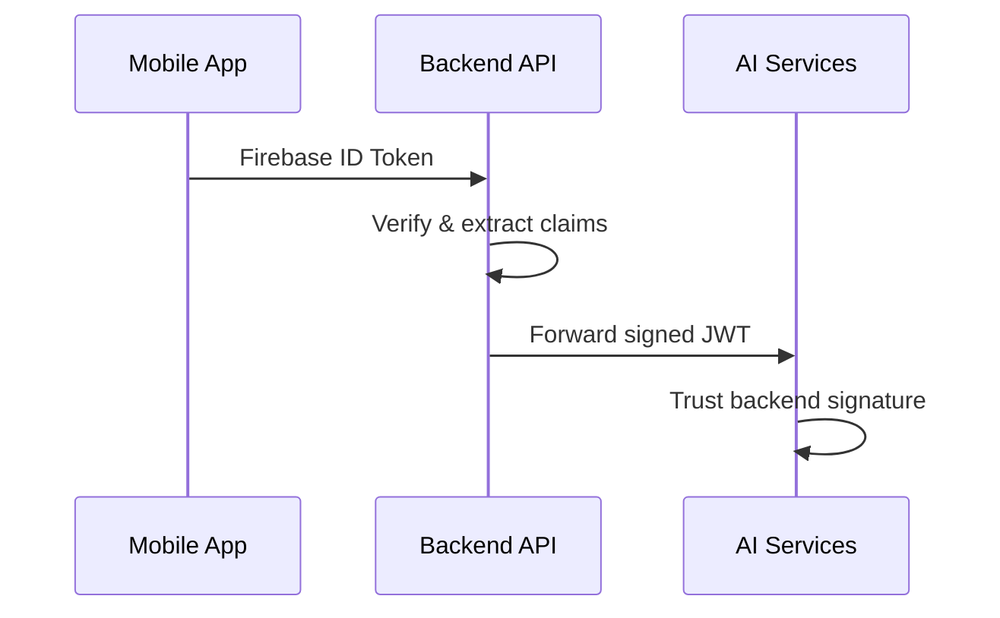

# 🏗️ TestAlex Microservices Architecture Plan

## 🎯 Executive Summary

Your TestAlex monorepo has grown to **9.5GB** and contains 6 distinct bounded contexts that should be separate repositories. This plan outlines a strategic refactoring to create focused, maintainable microservices following the Unix philosophy: **"Do one thing and do it well."**

---

## 📊 Current State Analysis

### Repository Size Breakdown
```
7.7GB  agentic-rag-system/     (80% of total!)
986MB  google-cloud-sdk/
611MB  node_modules/
548MB  ACIMguide/
209MB  instructor/
171MB  functions/
115MB  systematically-improving-rag/
53MB   venv/
```

### Problems with Current Monorepo
1. **🐌 Slow Development**: 7.7GB checkout kills productivity
2. **🔄 Tight Coupling**: Changes in RAG affect mobile app deployments
3. **🏗️ Build Complexity**: Single CI/CD for 6 different tech stacks
4. **📦 Dependency Hell**: Python, Node.js, Java SDK, Firebase all mixed
5. **👥 Team Scaling**: Hard to assign ownership boundaries
6. **🚀 Deployment Risk**: One bad commit breaks everything

---

## 🎯 Target Microservices Architecture

### 6 Focused Repositories

```mermaid
graph TB
    subgraph "Frontend Layer"
        A[acimguide-app<br/>📱 React Native + Expo]
        B[acimguide-backend<br/>⚡ Firebase Functions]
    end
    
    subgraph "AI Engine Layer"  
        C[ai-business-automation<br/>🤖 Autonomous Business]
        D[advanced-rag<br/>🧠 RAG + Instructor]
        E[orchestration-core<br/>🎼 Agents + Coordination]
    end
    
    subgraph "Infrastructure Layer"
        F[autonomous-ci-cd<br/>🔧 CI/CD + DevOps]
    end
    
    subgraph "Shared Layer"
        G[@testalex/common-js<br/>📦 TypeScript Utils]
        H[testalex-shared-py<br/>📦 Python Models]
    end
    
    A --> B
    A --> G
    B --> G
    C --> H
    D --> H
    E --> H
    E --> C
    E --> D
    F --> A
    F --> B
    F --> C
    F --> D
    F --> E
```

---

## 📋 Repository Specifications

### 1. `acimguide-app` (Frontend)
**Size**: ~550MB → ~50MB after cleanup  
**Tech Stack**: React Native, Expo, TypeScript  
**Responsibility**: Mobile apps (iOS/Android) + web frontend  

**Contents**:
- `ACIMguide/` → `/src`
- `public/` → `/web`
- Shared components, screens, services
- E2E tests with Playwright

**Deployment**: Firebase Hosting + Expo OTA updates

---

### 2. `acimguide-backend` (Core API)
**Size**: ~170MB → ~30MB after cleanup  
**Tech Stack**: Node.js, Firebase Functions, TypeScript  
**Responsibility**: Authentication, CourseGPT API, payment processing  

**Contents**:
- `functions/` → `/src`
- `firestore.rules` 
- Payment system (Stripe integration)
- User management & course delivery

**Deployment**: Firebase Functions + Firestore

---

### 3. `ai-business-automation` (Business AI)
**Size**: ~17MB → ~10MB after cleanup  
**Tech Stack**: Python, FastAPI, Celery  
**Responsibility**: Content generation, marketing automation, sales optimization  

**Contents**:
- `ai_automation/` → `/src`
- Autonomous business logic
- Marketing campaign management
- Revenue optimization algorithms

**Deployment**: Cloud Run + Cloud Tasks

---

### 4. `advanced-rag` (AI Research)
**Size**: ~8GB → ~2GB after cleanup  
**Tech Stack**: Python, LangChain, Vector DBs  
**Responsibility**: RAG systems, AI research, structured outputs  

**Contents**:
- `agentic-rag-system/` → `/agentic-rag`
- `systematically-improving-rag/` → `/systematic-rag`
- `instructor/` → `/instructor`
- Vector databases, embeddings, evaluations

**Deployment**: Cloud Run + Vertex AI

---

### 5. `orchestration-core` (Agent System)
**Size**: ~680KB → ~500KB  
**Tech Stack**: Python, AsyncIO, Pub/Sub  
**Responsibility**: Multi-agent coordination, autonomous pipelines  

**Contents**:
- `orchestration/` → `/orchestration`
- `agents/` → `/agents`
- Agent communication protocols
- Autonomous development workflows

**Deployment**: Cloud Run + Pub/Sub

---

### 6. `autonomous-ci-cd` (DevOps)
**Size**: ~2MB → ~1MB  
**Tech Stack**: Node.js, GitHub Actions, Terraform  
**Responsibility**: CI/CD automation, infrastructure as code  

**Contents**:
- `.github/workflows/` → `/workflows`
- CI debugging tools
- Infrastructure automation
- Deployment orchestration

**Deployment**: GitHub Actions + Terraform Cloud

---

## 🔗 Inter-Service Communication

### API Contracts (REST)
```typescript
// Stored in contracts/ repo, versioned independently
interface CourseGPTRequest {
  message: string;
  tone: "gentle" | "direct";
  userId: string;
}

interface CourseGPTResponse {
  response: string;
  messageId: string;
  latency: number;
}
```

### Event-Driven Architecture
```yaml
# Cloud Pub/Sub Topics
topics:
  - user.events.course-purchased
  - user.events.chat-completed  
  - agent.metrics.performance
  - system.events.deployment
```

### Authentication Flow


---

## 🔧 Migration Strategy

### Phase 1: Analysis & Planning (Week 1)
1. **Dependency Audit**: Map all cross-directory imports
2. **Shared Code Analysis**: Identify reusable utilities
3. **Database Schema Review**: Plan data ownership
4. **Team Ownership**: Assign maintainers to each repo

### Phase 2: Shared Libraries (Week 2)
1. **Create `@testalex/common-js`**:
   ```bash
   npm init -y
   npm install typescript @types/node
   # Add ACIM constants, validation, telemetry
   ```

2. **Create `testalex-shared-py`**:
   ```bash
   pip install poetry
   poetry init
   # Add Pydantic models, logging, OpenAI wrappers
   ```

### Phase 3: Repository Creation (Week 3)
```bash
# Use git filter-repo to preserve history
git clone --mirror TestAlex.git temp.git
cd temp.git
git filter-repo --path ACIMguide/ --path public/ --force
git remote add new git@github.com:org/acimguide-app.git
git push new --all --tags
```

### Phase 4: Refactoring (Week 4)
1. **Update imports**: `../utils/acim.js` → `@testalex/common-js`
2. **Fix dependencies**: Remove unused packages
3. **Update CI/CD**: Repo-specific workflows
4. **Add README**: Clear setup instructions

### Phase 5: Deployment & Testing (Week 5)
1. **Deploy to staging**: All 6 repos
2. **Run integration tests**: Full E2E suite
3. **Performance testing**: Load test APIs
4. **Security review**: Authentication flows

### Phase 6: Production Cutover (Weekend)
1. **Code freeze**: Main branch protection
2. **Tag release**: `v1.0.0-monorepo-final`
3. **Deploy microservices**: Blue/green deployment
4. **Monitor dashboards**: 48-hour observation
5. **Archive monorepo**: Read-only mode

---

## 📦 Shared Package Design

### `@testalex/common-js`
```typescript
// constants/acim.ts
export const ACIM_LESSONS = {
  1: "Nothing I see means anything",
  2: "I have given everything I see all the meaning it has for me",
  // ... 365 lessons
};

// validation/spiritual.ts
export function validateACIMContent(text: string): boolean {
  // Ensure only authentic ACIM references
}

// telemetry/sentry.ts
export function initSpiritual Monitoring(dsn: string) {
  // Privacy-safe error tracking
}
```

### `testalex-shared-py`
```python
# models/acim.py
from pydantic import BaseModel

class ACIMLesson(BaseModel):
    day: int
    title: str
    reference: str
    contemplation: str

# clients/openai.py  
class SpiritualOpenAIClient:
    def __init__(self, api_key: str):
        # Wrapper with ACIM-specific validation
```

---

## 🎯 Benefits After Migration

### Development Velocity
- **⚡ 20x Faster Clones**: 50MB vs 9.5GB
- **🔄 Independent Deployments**: Frontend changes don't affect RAG
- **🧪 Focused Testing**: Repo-specific test suites
- **📦 Smaller Docker Images**: 100MB vs 2GB+

### Team Productivity
- **👥 Clear Ownership**: Each team owns 1-2 repos
- **🔐 Fine-Grained Permissions**: Junior devs can't break production
- **📚 Simpler Onboarding**: New devs clone 1 repo, not everything
- **🎯 Specialized Expertise**: AI team focuses on RAG, not React

### Operational Benefits
- **🚀 Faster CI/CD**: 2-minute builds vs 20-minute builds
- **📊 Better Monitoring**: Service-specific dashboards
- **🔧 Easier Debugging**: Isolated failure domains
- **💰 Cost Optimization**: Scale services independently

---

## ⚠️ Migration Risks & Mitigations

### Risk 1: Breaking Changes
**Mitigation**: Comprehensive contract testing + feature flags

### Risk 2: Team Coordination
**Mitigation**: Weekly cross-team standups + shared Slack channels

### Risk 3: Shared Data Dependencies
**Mitigation**: Database-per-service + event sourcing for sync

### Risk 4: Authentication Complexity
**Mitigation**: Centralized Firebase Auth + JWT forwarding

---

## 📈 Success Metrics

### Technical KPIs
- **Build Time**: < 5 minutes per repo (vs 20+ minutes)
- **Test Feedback**: < 2 minutes (vs 10+ minutes)
- **Deployment Frequency**: Daily vs weekly
- **Mean Time to Recovery**: < 10 minutes vs hours

### Business KPIs
- **Developer Productivity**: 2x faster feature delivery
- **System Reliability**: 99.9% uptime per service
- **Team Satisfaction**: Higher autonomy scores
- **Cost Efficiency**: 30% lower infrastructure costs

---

## 🎯 Next Steps

1. **Start with Advanced RAG**: It's 80% of your repo size
2. **Create shared libraries**: Foundation for other services  
3. **Migrate one service per week**: Reduce risk, learn iteratively
4. **Automate everything**: Scripts for repo creation, CI setup
5. **Monitor closely**: Dashboards for each migration phase

---

## 🏆 The Vision

**Transform from:**
- 1 massive 9.5GB monolith
- 6+ different tech stacks mixed together
- Single point of failure
- 20+ minute build times
- Team coordination bottlenecks

**Into:**
- 6 focused microservices (50MB - 2GB each)
- Clear separation of concerns
- Independent deployment pipelines  
- 2-5 minute build times per service
- Autonomous team productivity

**Result**: A maintainable, scalable spiritual AI platform that can grow to serve millions of ACIM students while preserving authentic spiritual integrity.

---

*This architecture honors both technical excellence and spiritual purpose - creating a system that serves the highest good while remaining elegantly simple and maintainable.* 🕊️

**Ready to begin the transformation? Let's start with the Advanced RAG extraction - it will free up 7.7GB immediately!** 🚀
