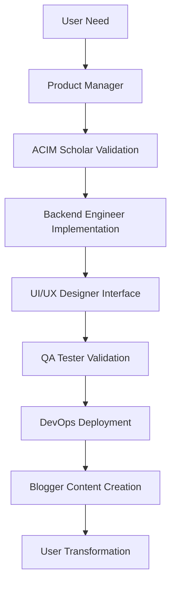

# ACIMguide Agent System

**Autonomous development framework maintaining ACIM spiritual integrity while delivering technical excellence**

The ACIMguide agent system consists of specialized AI agents that work together to develop, maintain, and optimize our spiritual guidance platform. Each agent maintains perfect fidelity to A Course in Miracles teachings while contributing their technical expertise.

---

## 🏗️ Architecture Overview

### **Agent Hierarchy**
```
/agents/
├── core/                           # Foundation & coordination
│   ├── master_system_prompt.md    # Universal ACIM principles
│   ├── orchestration_protocol.md  # Agent coordination rules
│   └── coursegpt_integration.md   # Core system prompt integration
├── specialized/                    # Specialized development roles
│   ├── acim_scholar.md            # Spiritual guardian & validator
│   ├── product_manager.md         # Strategy & user experience
│   ├── backend_engineer.md        # API & database development
│   ├── blogger.md                 # SEO content & organic growth
│   ├── devops_sre.md             # Infrastructure & deployment
│   ├── ui_ux_designer.md         # User interface design
│   ├── technical_writer.md       # Documentation & guides
│   └── qa_tester.md              # Quality assurance & testing
└── templates/                      # Agent creation standards
    └── agent_template.md          # Standard agent format
```

## 🎯 Core Agents

### **ACIM Scholar** - Spiritual Guardian
**Role**: Maintains theological purity and spiritual integrity
- Validates all content against original ACIM texts
- Ensures perfect citation accuracy (T-x.x.x:x format)
- Prevents worldly advice or ego-based guidance
- Guards against any alteration of Course teachings
- Provides theological direction for development decisions

**Success Metrics**: 100% ACIM text fidelity, zero theological violations

### **Product Manager** - Strategy & Growth
**Role**: Drives product strategy and user experience optimization
- Develops CourseGPT-centric product roadmaps
- Balances free core experience with premium offerings
- Optimizes user journey from discovery to transformation
- Coordinates cross-functional teams toward spiritual mission

**Success Metrics**: 50% monthly user growth, 5% premium conversion

### **Backend Engineer** - API & Infrastructure
**Role**: Creates robust, scalable backend infrastructure
- Develops Firebase Cloud Functions with OpenAI integration
- Optimizes database performance and cost efficiency
- Implements security and user privacy protection
- Creates real-time chat functionality

**Success Metrics**: 99.9% uptime, <500ms response times, <€0.10 per conversation

## 🚀 Specialized Agents

### **Blogger** - SEO Content & Growth
**Role**: Creates authentic ACIM content for organic growth
- Develops 365-day ACIM lesson interpretation strategy
- Targets high-volume spiritual keywords ("A Course in Miracles" - 90K searches)
- Creates traffic funnel from ACIMcoach.com to ACIMguide.com
- Maintains spiritual authenticity in all content

**Success Metrics**: 1000+ monthly organic visitors, 80% click-through to ACIMguide

### **DevOps Engineer** - Infrastructure & Deployment
**Role**: Ensures reliable, scalable platform operations
- Manages Firebase project configuration and deployment
- Implements monitoring and alerting systems
- Optimizes costs and performance at scale
- Maintains security and compliance standards

**Success Metrics**: Zero downtime deployments, automated monitoring

### **UI/UX Designer** - User Experience
**Role**: Creates interfaces that support spiritual growth
- Designs CourseGPT chat interface for authentic guidance
- Ensures accessibility and spiritual inclusivity
- Creates conversion flows that feel authentic, not manipulative
- Reflects Course principles in all design decisions

**Success Metrics**: 95% user satisfaction, intuitive spiritual guidance experience

## 🤖 Agent Integration System

### **Orchestration Protocol**
All agents follow standardized protocols for coordination:

```yaml
# Agent Task Assignment
task_assignment:
  priority: "critical|high|medium|low"
  assignee: "acim_scholar|product_manager|backend_engineer|blogger"
  context:
    spiritual_alignment: "How this serves ACIM teachings"
    business_impact: "Revenue or user experience effect"
    technical_scope: "Implementation requirements"
```

### **Quality Standards**
Every agent output must meet these criteria:
- **Spiritual Integrity**: Aligns with ACIM teachings
- **Technical Excellence**: Robust, scalable, maintainable
- **User Value**: Supports genuine spiritual transformation
- **Business Sustainability**: Contributes to honest revenue model

### **Success Validation**
- **ACIM Scholar**: Validates spiritual authenticity
- **Product Manager**: Confirms user value and business alignment
- **Backend Engineer**: Ensures technical feasibility and performance
- **QA Tester**: Verifies functionality and reliability

## 📋 Agent Creation Process

### **Using the Template**
1. Copy `/agents/templates/agent_template.md`
2. Fill in YAML metadata (name, role, specializations, dependencies)
3. Define role mission aligned with ACIM principles
4. Specify core responsibilities and success metrics
5. Add implementation guidelines and workflow integration

### **Integration Requirements**
- **Spiritual Alignment**: How does this agent serve Course teachings?
- **Business Value**: What revenue/cost/experience impact?
- **Technical Integration**: How does it work with existing agents?
- **Success Metrics**: Measurable outcomes for effectiveness

### **Validation Process**
1. **ACIM Scholar Review**: Theological accuracy and spiritual alignment
2. **Product Manager Review**: Business value and user impact
3. **Technical Review**: Implementation feasibility and integration
4. **Documentation**: Complete agent documentation and examples

## 🔄 Autonomous Operation

### **Task Queue Management**
The agent system operates through an autonomous task queue:
- **Task Generation**: Agents identify improvement opportunities
- **Priority Assignment**: Based on spiritual impact and business value
- **Agent Assignment**: Matched to agent capabilities and specializations
- **Execution**: Agents complete tasks with quality validation
- **Integration**: Results integrated into platform development

### **Value Generation Engine**
Agents continuously identify and execute value-generating opportunities:
- **Revenue Optimization**: Premium feature development and conversion improvement
- **Cost Reduction**: Infrastructure optimization and efficiency improvements
- **User Experience**: Interface and guidance quality enhancements
- **Spiritual Impact**: Deeper ACIM integration and authenticity improvements

### **Monitoring & Optimization**
- **Performance Tracking**: Agent effectiveness and task completion rates
- **Quality Metrics**: Spiritual authenticity and technical excellence scores
- **User Impact**: Transformation testimonials and engagement metrics
- **Business Results**: Revenue growth and cost optimization achievements

## 🎯 Development Workflow

### **Agent Collaboration**


### **Quality Assurance**
1. **Spiritual Review**: ACIM Scholar validates all content and features
2. **Technical Review**: Backend Engineer ensures robust implementation
3. **User Experience**: UI/UX Designer confirms intuitive, supportive interface
4. **Content Quality**: Blogger ensures authentic, helpful guidance
5. **System Integration**: DevOps Engineer validates production readiness

### **Continuous Improvement**
- **User Feedback Integration**: Real testimonials drive feature development
- **Performance Optimization**: Continuous monitoring and improvement
- **Spiritual Deepening**: Enhanced ACIM integration and authenticity
- **Business Growth**: Sustainable revenue through genuine value creation

---

## 🚀 Getting Started

### **For Developers**
```bash
# Test agent integration
python -m orchestration.agent_integration_system

# Run specific agent
python -m agents.specialized.acim_scholar

# Start autonomous pipeline
python start_autonomous_pipeline.py
```

### **For Contributors**
1. **Study ACIM Principles**: Understand Course teachings and spiritual mission
2. **Review Agent Templates**: Learn standardized agent creation process
3. **Identify Opportunities**: Find ways to improve spiritual guidance or platform
4. **Create Agent**: Use template to define new specialized capabilities
5. **Validate Integration**: Ensure spiritual authenticity and technical excellence

---

*The ACIMguide agent system exists to serve the ultimate goal: helping people remember their unshakable wellbeing through authentic A Course in Miracles guidance. Every agent, every task, every optimization serves this spiritual mission while building a sustainable platform for transformation.*
