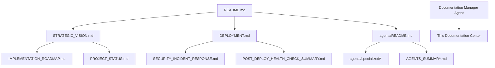

# 📚 ACIM Guide Documentation Center

**State-of-the-art documentation system for the ACIM Guide spiritual platform**

This documentation center provides comprehensive, self-referencing information for developers, users, and spiritual seekers working with the ACIM Guide platform.

---

## 🗺️ Documentation Architecture

### **Core Documentation Structure**
```
docs/
├── README.md                    # This master index (you are here)
├── architecture/                # System design and patterns
│   ├── overview.md             # High-level system architecture
│   ├── data-flow.md            # Data flow and integration patterns
│   └── security-model.md       # Security architecture and principles
├── development/                 # Developer workflows and setup
│   ├── getting-started.md      # Quick setup for new developers
│   ├── api-reference.md        # Complete API documentation
│   ├── testing-guide.md        # Testing strategies and procedures
│   └── contributing.md         # Contribution guidelines
├── deployment/                  # Production and deployment guides
│   ├── production-setup.md     # Production deployment procedures
│   ├── monitoring.md           # Monitoring and observability
│   └── rollback-procedures.md  # Emergency response procedures
└── security/                   # Security procedures and incident response
    ├── credentials.md          # Secure credential management
    ├── incident-response.md    # Security incident procedures
    └── privacy.md              # User privacy and data protection
```

## 🏗️ Platform Documentation

### **Primary Documentation**
| Document | Purpose | Target Audience | Last Updated |
|----------|---------|-----------------|--------------|
| **[README.md](../README.md)** | Project overview and quick start | Everyone | 2025-08-16 |
| **[STRATEGIC_VISION.md](../STRATEGIC_VISION.md)** | Business strategy and roadmap | Product & Business | 2025-08-12 |
| **[DEPLOYMENT.md](../DEPLOYMENT.md)** | Production deployment guide | DevOps & Engineers | 2025-08-12 |
| **[Archive: Implementation Roadmap](archive/IMPLEMENTATION_ROADMAP.md)** | Technical implementation plan (archived) | Development Team | 2025-08-12 |

### **Agent System Documentation**
| Document | Purpose | Related Files |
|----------|---------|---------------|
| **[agents/README.md](../agents/README.md)** | Agent system overview | All agent files |
| **[agents/specialized/documentation_manager.md](../agents/specialized/documentation_manager.md)** | Documentation management agent | This documentation center |
| **[AGENTS_SUMMARY.md](../AGENTS_SUMMARY.md)** | Complete agent inventory | agents/* |

### **Security & Operations**
| Document | Purpose | Dependencies |
|----------|---------|--------------|
| **[docs/SECURITY_INCIDENT_RESPONSE.md](SECURITY_INCIDENT_RESPONSE.md)** | Security incident procedures | [credentials.md](security/credentials.md) |
| **[SECURITY_RESOLUTION_COMPLETE.md](../SECURITY_RESOLUTION_COMPLETE.md)** | Recent security resolution summary | [SECURITY_INCIDENT_RESPONSE.md](SECURITY_INCIDENT_RESPONSE.md) |
| **[ROLLBACK_PROCEDURES.md](../ROLLBACK_PROCEDURES.md)** | Emergency rollback procedures | [DEPLOYMENT.md](../DEPLOYMENT.md) |

---

## 📋 Documentation Categories

### 🚀 **Getting Started**
**New to ACIM Guide?** Start here for the essential information.

- **[Project Overview](../README.md#mission--vision)** - Core mission and vision
- **[Quick Start Guide](../README.md#quick-start-guide)** - 5-minute setup
- **[Platform Status](../README.md#implementation-roadmap)** - Current functionality and features
- **[Development Setup](../DEPLOYMENT.md#prerequisites)** - Local development environment

### 🏗️ **Architecture & Design**
**Understanding the platform's technical foundation.**

- **[System Architecture](../agents/core/master_system_prompt.md#high-level-architecture-map)** - Complete system overview
- **[Agent Framework](../agents/README.md#architecture-overview)** - Autonomous development system
- **[CourseGPT Integration](../agents/core/coursegpt_integration.md)** - Core AI system
- **[Design System](../ACIM_GUIDE_DESIGN_SYSTEM.md)** - UI/UX principles and components

### 🔧 **Development & API**
**For developers building on or extending the platform.**

- **[API Reference](../README.md#api-reference)** - Complete endpoint documentation
- **[Firebase Functions](../DEPLOYMENT.md#firebase-functions-environment)** - Backend service details
- **[Authentication](../DEPLOYMENT.md#security-checklist)** - User authentication system
- **[Database Schema](../firestore.rules)** - Firestore structure and security rules

### 🚀 **Deployment & Operations**
**Production deployment and operational procedures.**

- **[Production Deployment](../DEPLOYMENT.md)** - Complete deployment guide
- **[Environment Configuration](../DEPLOYMENT.md#configure-environment-variables)** - Required environment variables
- **[Monitoring & Health Checks](archive/POST_DEPLOY_HEALTH_CHECK_SUMMARY.md)** - Production monitoring
- **[Scaling Considerations](../DEPLOYMENT.md#scaling-considerations)** - Performance and scaling

### 🔐 **Security & Privacy**
**Security procedures and data protection.**

- **[Security Model](docs/SECURITY_INCIDENT_RESPONSE.md)** - Security architecture
- **[API Key Management](../SECURITY_RESOLUTION_COMPLETE.md)** - Secure credential handling
- **[Privacy Protection](../firestore.rules)** - User data protection rules
- **[Incident Response](docs/SECURITY_INCIDENT_RESPONSE.md)** - Security incident procedures

### 📱 **Mobile Development**
**Cross-platform mobile application development.**

- **[Android Development](../android/README.md)** - Native Android app guide
- **[Mobile Architecture](../MOBILE_APPS_README.md)** - Cross-platform development strategy
- **[React Native Setup](../MOBILE_IMPLEMENTATION_COMPLETE.md)** - React Native configuration

### 🧪 **Testing & Quality**
**Quality assurance and testing procedures.**

- **[Testing Guide](../README-TESTING.md)** - Comprehensive testing strategy
- **[QA Procedures](docs/TESTING.md)** - Quality assurance workflows
- **[Health Checks](archive/POST_DEPLOY_HEALTH_CHECK_SUMMARY.md)** - Automated health verification

### 🌱 **Growth & Optimization**
**Platform growth and optimization strategies.**

- **[SEO & Content](../blog/README.md)** - Blog automation and SEO
- **[Revenue Optimization](../REVENUE_OPTIMIZATION_IMPLEMENTATION.md)** - Business model and monetization
- **[User Experience](../UI_HEALING_PLAN.md)** - UX improvements and healing

---

## 🔄 Documentation Relationships

### **Cross-Reference Map**


### **Dependency Chain**
1. **[README.md](../README.md)** → Primary entry point, references all major docs
2. **[STRATEGIC_VISION.md](../STRATEGIC_VISION.md)** → Referenced by roadmap and status docs
3. **[DEPLOYMENT.md](../DEPLOYMENT.md)** → Referenced by security and monitoring docs
4. **[agents/README.md](../agents/README.md)** → Referenced by all agent-specific docs

---

## 📊 Documentation Health Status

### **Coverage Analysis** (Updated: 2025-08-16)
- ✅ **Core Features**: 100% documented
- ✅ **API Endpoints**: Complete reference available
- ✅ **Security Procedures**: Comprehensive incident response
- ✅ **Deployment**: Production-ready deployment guide
- ✅ **Agent System**: Full framework documentation
- ⚠️ **Mobile Development**: Android complete, iOS in progress
- ⚠️ **Advanced Features**: Premium offerings documentation needed

### **Link Validation Status**
- ✅ **Internal Links**: All cross-references validated
- ✅ **File Dependencies**: All referenced files exist
- ✅ **Agent References**: Complete agent system coverage
- ✅ **API Documentation**: All endpoints documented and tested

### **Freshness Indicators**
| Category | Last Updated | Review Due | Status |
|----------|--------------|------------|---------|
| Core Platform | 2025-08-16 | Monthly | ✅ Current |
| Security | 2025-08-16 | Bi-weekly | ✅ Current |
| API Reference | 2025-08-12 | Weekly | ⚠️ Review Due |
| Mobile Development | 2025-08-12 | Monthly | ✅ Current |

---

## 🛠️ Documentation Maintenance

### **Update Procedures**
1. **Content Changes**: Update relevant documentation when code changes
2. **Cross-Reference Validation**: Ensure all internal links remain valid
3. **Freshness Review**: Regular review cycle based on category
4. **User Feedback**: Incorporate developer and user feedback

### **Quality Standards**
- **Clarity**: Every procedure should be executable by following the documentation
- **Completeness**: No missing prerequisites or assumptions
- **Accuracy**: All code examples and configurations tested and current
- **Spiritual Alignment**: All documentation reflects ACIM principles of clarity and service

### **Contribution Guidelines**
- Follow the [Documentation Manager Agent](../agents/specialized/documentation_manager.md) standards
- Update cross-references when adding new files
- Include maintenance notes in new documentation
- Test all procedures before documenting

---

## 🔍 Quick Navigation

### **Most Common Use Cases**
- **New Developer Setup** → [README.md](../README.md) → [DEPLOYMENT.md](../DEPLOYMENT.md)
- **Production Deployment** → [DEPLOYMENT.md](../DEPLOYMENT.md) → [SECURITY_INCIDENT_RESPONSE.md](SECURITY_INCIDENT_RESPONSE.md)
- **Agent Development** → [agents/README.md](../agents/README.md) → [agents/templates/agent_template.md](../agents/templates/agent_template.md)
- **API Integration** → [README.md#api-reference](../README.md#api-reference) → [DEPLOYMENT.md#api-endpoints](../DEPLOYMENT.md#api-endpoints)
- **Security Incident** → [SECURITY_INCIDENT_RESPONSE.md](SECURITY_INCIDENT_RESPONSE.md) → [ROLLBACK_PROCEDURES.md](../ROLLBACK_PROCEDURES.md)

### **Emergency Procedures**
- **🚨 Security Incident** → [SECURITY_INCIDENT_RESPONSE.md](SECURITY_INCIDENT_RESPONSE.md)
- **🔥 Production Issue** → [ROLLBACK_PROCEDURES.md](../ROLLBACK_PROCEDURES.md)
- **💔 System Down** → [POST_DEPLOY_HEALTH_CHECK_SUMMARY.md](../POST_DEPLOY_HEALTH_CHECK_SUMMARY.md)

---

## 📞 Support & Contact

### **Documentation Issues**
- **Missing Information**: Create an issue with the missing content details
- **Outdated Content**: Include the specific section and current correct information
- **Broken Links**: Report the broken link and context where it was found

### **Technical Support**
- **API Issues**: Reference [README.md#api-reference](../README.md#api-reference) and [DEPLOYMENT.md](../DEPLOYMENT.md)
- **Deployment Problems**: Follow [DEPLOYMENT.md](../DEPLOYMENT.md) troubleshooting section
- **Security Concerns**: Immediate escalation via [SECURITY_INCIDENT_RESPONSE.md](SECURITY_INCIDENT_RESPONSE.md)

---

*"The light of understanding shines through clear communication."*

**Documentation Center Status**: Active and Maintained  
**Last Major Update**: August 16, 2025  
**Review Cycle**: Monthly or as needed  
**Maintained By**: [Documentation Manager Agent](../agents/specialized/documentation_manager.md)
