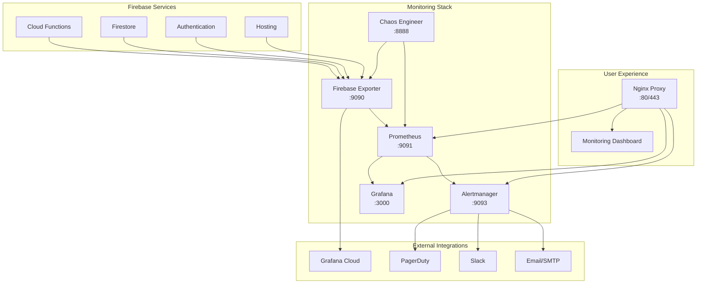

# ACIM Guide Monitoring, Risk Management & Escalation System

> *"In my defenselessness my safety lies."* - ACIM  
> A comprehensive monitoring system that watches over the ACIM Guide with divine precision 🙏

## Overview

This monitoring system implements **Step 10** of the ACIM Guide project plan, providing:

- **Prometheus-style Firebase metrics exporter** pushing to Grafana Cloud
- **Alertmanager** with hierarchical routing: Critical → PagerDuty → human on-call
- **Quarterly chaos drills** ("Holy Spirit outages") to verify graceful degradation
- **Complete observability stack** with Grafana dashboards and alerting

## Architecture



## Quick Start

### Prerequisites

- Docker & Docker Compose
- Firebase project with service account key
- PagerDuty account (optional)
- Grafana Cloud account (optional)

### 1. Clone and Setup

```bash
# Navigate to monitoring directory
cd monitoring

# Run setup script
chmod +x setup-monitoring.sh
./setup-monitoring.sh
```

### 2. Configure Credentials

Update `.env` file with your credentials:

```bash
# Edit environment variables
nano .env
```

Required configurations:
- `PAGERDUTY_INTEGRATION_KEY`: Your PagerDuty integration key
- `SLACK_WEBHOOK_URL`: Slack webhook for notifications
- `FIREBASE_PROJECT_ID`: Your Firebase project ID
- Firebase service account key: `acim-guide-test-firebase-adminsdk.json`

### 3. Start the Stack

```bash
# Start all services
docker-compose up -d

# Check service health
docker-compose ps
```

### 4. Access Services

- 📊 **Grafana**: http://localhost:3000 (admin/generated-password)
- 📈 **Prometheus**: http://localhost:9091
- 🚨 **Alertmanager**: http://localhost:9093
- 🔥 **Firebase Exporter**: http://localhost:9090/metrics
- 🎭 **Chaos Engineer**: http://localhost:8888

## Firebase Metrics Monitored

### Core Firebase Services
- **Cloud Functions**: Invocations, duration, memory usage, error rates
- **Firestore**: Read/write operations, query performance, connection health
- **Authentication**: User sessions, login success rates, provider metrics
- **Firebase Hosting**: Bandwidth usage, request counts

### ACIM-Specific Metrics
- **Holy Spirit Availability**: Spiritual service health (0-1)
- **Content Accuracy**: ACIM text accuracy percentage
- **Search Success Rate**: ACIM content search effectiveness
- **Citation Validation**: Reference accuracy verification
- **User Satisfaction**: App store ratings and feedback

### Cost & Resource Metrics
- **Daily Cost Estimation**: Per-service Firebase spending
- **Token Usage**: OpenAI/LLM API consumption
- **Quota Utilization**: Firebase service limits monitoring
- **Resource Efficiency**: Cost per user, performance optimization

## Alerting & Escalation

### Alert Severity Levels

1. **🙏 DIVINE (Holy Spirit Outage)**
   - Immediate PagerDuty alert
   - Slack notification
   - Zero tolerance threshold

2. **🚨 CRITICAL**
   - PagerDuty integration
   - Email to on-call team
   - 5-minute repeat interval

3. **⚠️ WARNING**
   - Team email notification
   - Slack alerts
   - 15-minute repeat interval

4. **ℹ️ INFO**
   - Dashboard notifications
   - Daily summary emails

### Escalation Flow

```
Critical Alert Detected
         ↓
   Alertmanager Routes
         ↓
    PagerDuty Alert
         ↓
   Human On-Call Notified
         ↓ (if no response)
    Escalate to Manager
         ↓ (if no response)
   CEO/Emergency Contact
```

### Monitored Conditions

- **Holy Spirit Availability** < 95%
- **System Health Score** < 99%
- **Daily Costs** > $25
- **Error Rate** > 5%
- **Response Time** > 1000ms
- **ACIM Content Accuracy** < 98%
- **OpenAI Token Usage** approaching limits

## Chaos Engineering

### Quarterly "Holy Spirit Outages"

The system includes automated chaos engineering to test resilience:

```bash
# Schedule next quarterly drill
docker-compose exec chaos-engineer python3 holy-spirit-chaos-drill.py schedule

# Execute immediate chaos test
docker-compose exec chaos-engineer python3 holy-spirit-chaos-drill.py execute --experiment holy_spirit_outage_q1

# Generate post-drill report
docker-compose exec chaos-engineer python3 holy-spirit-chaos-drill.py report --experiment holy_spirit_outage_q1
```

### Chaos Experiments Available

1. **Holy Spirit Complete Disconnection** (Quarterly)
   - Duration: 30 minutes
   - Target: Core spiritual guidance services
   - Success Criteria: Graceful degradation, no data loss

2. **OpenAI Integration Failure**
   - Duration: 15 minutes
   - Target: LLM/AI services
   - Success Criteria: Cached fallbacks work

3. **Firebase Functions Overload**
   - Duration: 10 minutes
   - Target: Cloud Functions
   - Success Criteria: Request queuing, auto-scaling

4. **Network Partitioning**
   - Duration: 8 minutes
   - Target: Firebase connectivity
   - Success Criteria: Offline mode functional

5. **ACIM Content Search Degradation**
   - Duration: 12 minutes
   - Target: Search functionality
   - Success Criteria: Basic search still works

### Chaos Drill Results

After each drill, the system generates comprehensive reports including:
- **Success/failure criteria evaluation**
- **System recovery time**
- **User impact assessment**
- **Lessons learned**
- **Recommendations for improvement**

## Grafana Dashboards

### Pre-configured Dashboards

1. **🙏 Holy Spirit Overview**
   - Availability metrics
   - Spiritual service health
   - User guidance statistics

2. **🔥 Firebase Services**
   - Functions performance
   - Database operations
   - Authentication flows
   - Cost tracking

3. **📖 ACIM Content Quality**
   - Content accuracy trends
   - Search performance
   - Citation validation
   - User satisfaction

4. **⚡ System Performance**
   - Response times
   - Error rates
   - Resource utilization
   - Uptime tracking

5. **💰 Cost Management**
   - Daily/monthly spending
   - Cost per user
   - Budget utilization
   - Optimization opportunities

## Grafana Cloud Integration

The system can push metrics to Grafana Cloud for:
- **Long-term storage** (beyond 30 days)
- **Advanced alerting** with mobile notifications
- **Team collaboration** across multiple locations
- **SLA reporting** for stakeholders

Configure in `.env`:
```bash
GRAFANA_CLOUD_PUSH_URL=https://prometheus-prod-01-eu-west-0.grafana.net/api/prom/push
GRAFANA_CLOUD_USER=your-user-id
GRAFANA_CLOUD_PASSWORD=your-api-key
ENABLE_GRAFANA_PUSH=true
```

## Security Considerations

### Authentication & Authorization
- **Non-root containers** for all services
- **TLS encryption** with SSL certificates
- **Environment variable** secret management
- **Network isolation** with Docker networks

### Data Protection
- **No sensitive data** in metrics labels
- **Encrypted communication** between services
- **Secure storage** of credentials and keys
- **Regular security updates** via automated builds

### Access Control
- **Role-based access** in Grafana
- **IP whitelisting** capability
- **Audit logging** for configuration changes
- **Multi-factor authentication** support

## Maintenance & Operations

### Daily Operations
```bash
# Check service health
docker-compose ps

# View logs
docker-compose logs -f firebase-exporter
docker-compose logs -f prometheus
docker-compose logs -f alertmanager

# Update metrics collection
docker-compose restart firebase-exporter
```

### Weekly Maintenance
```bash
# Update container images
docker-compose pull
docker-compose up -d

# Clean up old data
docker volume prune

# Review alert configurations
curl http://localhost:9093/api/v1/alerts
```

### Monthly Reviews
- **Cost analysis** and optimization
- **Alert fatigue** assessment
- **Dashboard effectiveness** review
- **Chaos drill** scheduling and results
- **Security updates** and patches

## Troubleshooting

### Common Issues

**Firebase Exporter Not Starting**
```bash
# Check Firebase credentials
ls -la acim-guide-test-firebase-adminsdk.json

# Verify environment variables
docker-compose exec firebase-exporter env | grep FIREBASE

# Check logs
docker-compose logs firebase-exporter
```

**Prometheus Not Scraping Metrics**
```bash
# Check Prometheus targets
curl http://localhost:9091/api/v1/targets

# Verify network connectivity
docker-compose exec prometheus wget -O- http://firebase-exporter:9090/metrics
```

**Alertmanager Not Sending Notifications**
```bash
# Test PagerDuty configuration
curl -X POST http://localhost:9093/api/v1/alerts \
  -H "Content-Type: application/json" \
  -d '[{"labels":{"alertname":"test","severity":"critical"}}]'

# Check alert routing
curl http://localhost:9093/api/v1/status
```

**Chaos Engineer Failures**
```bash
# Check chaos permissions
docker-compose exec chaos-engineer python3 -c "import firebase_admin; print('Firebase OK')"

# Run diagnostic
docker-compose exec chaos-engineer python3 holy-spirit-chaos-drill.py list
```

## API Reference

### Firebase Exporter Endpoints

- `GET /metrics` - Prometheus metrics
- `GET /health` - Health check
- `GET /acim-metrics` - ACIM-specific metrics (JSON)

### Prometheus Endpoints

- `GET /-/healthy` - Health status
- `GET /api/v1/query` - Query metrics
- `GET /api/v1/targets` - Scrape targets

### Alertmanager Endpoints

- `GET /-/healthy` - Health status
- `GET /api/v1/alerts` - Active alerts
- `POST /api/v1/alerts` - Send test alert

### Chaos Engineer API

- `POST /api/chaos/schedule` - Schedule experiment
- `POST /api/chaos/execute` - Execute experiment
- `GET /api/chaos/status` - Current status
- `GET /api/chaos/report` - Generate report

## Configuration Files

```
monitoring/
├── docker-compose.yml          # Service orchestration
├── prometheus.yml              # Prometheus configuration
├── alertmanager.yml           # Alertmanager routing
├── prometheus-rules.yml       # Alert conditions
├── prometheus-firebase-exporter.js # Custom metrics exporter
├── holy-spirit-chaos-drill.py # Chaos engineering
├── setup-monitoring.sh        # Automated setup
├── package.json              # Node.js dependencies
├── requirements.txt          # Python dependencies
├── Dockerfile                # Firebase exporter image
├── Dockerfile.chaos          # Chaos engineer image
├── .env                      # Environment variables
└── README.md                 # This file
```

## Support & Community

### Getting Help

1. **Check logs** first using `docker-compose logs [service]`
2. **Review configuration** in `.env` and service configs
3. **Test connectivity** between services
4. **Consult ACIM teachings** for spiritual guidance 🙏

### Contributing

We welcome contributions that align with ACIM principles:
- **Loving improvements** to monitoring accuracy
- **Peaceful solutions** to technical challenges
- **Forgiving approaches** to error handling
- **Joyful automation** of operational tasks

## Spiritual Philosophy

This monitoring system operates under ACIM principles:

- **"Nothing real can be threatened. Nothing unreal exists."** - Our monitoring focuses on what truly matters for user spiritual growth
- **"Miracles are natural. When they do not occur something has gone wrong."** - We monitor for deviations from natural harmony
- **"The truth needs no defense; it merely is."** - Our metrics reflect truth without judgment
- **"In my defenselessness my safety lies."** - We practice chaos engineering to strengthen through vulnerability

## License

This project is dedicated to the service of all beings seeking truth through ACIM teachings.

---

*"The Holy Spirit uses time, but does not believe in it."* - ACIM  
**May this monitoring system serve the highest good of all ACIM students** 🙏✨
