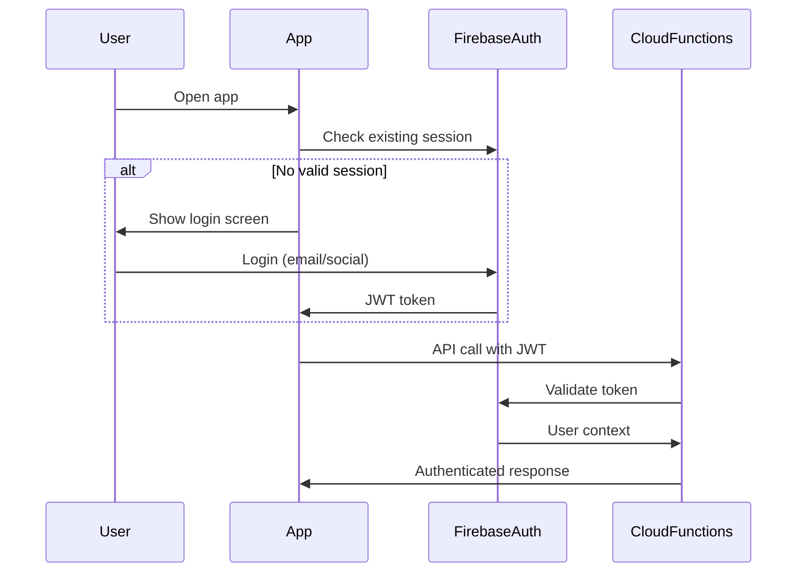

# 03. API Specifications

*"Communication is the only function that you have here." — ACIM*

## API Overview

The ACIMguide API ecosystem consists of Firebase Cloud Functions providing spiritual guidance services and external integrations with OpenAI for CourseGPT functionality. All APIs follow RESTful principles while embracing the spiritual simplicity that ACIM teaches.

## Service Endpoints

### Base URLs

| Environment | Firebase Cloud Functions | OpenAI Platform |
|-------------|-------------------------|-----------------|
| **Development** | `https://us-central1-acimguide-dev.cloudfunctions.net` | `https://api.openai.com/v1` |
| **Staging** | `https://us-central1-acimguide-staging.cloudfunctions.net` | `https://api.openai.com/v1` |
| **Production** | `https://us-central1-acimguide.cloudfunctions.net` | `https://api.openai.com/v1` |

## Authentication & Authorization

### Firebase Authentication
All API endpoints (except health checks) require Firebase Authentication tokens.

```typescript
interface AuthHeaders {
  "Authorization": "Bearer <firebase_jwt_token>"
  "Content-Type": "application/json"
  "User-Agent": "ACIMguide-Mobile/1.0.0"
}
```

### Authentication Flow


## Core APIs

### 1. Chat with CourseGPT

#### `chatWithAssistant`
**Endpoint:** `POST /chatWithAssistant`  
**Type:** Firebase Callable Function  
**Purpose:** Engage in spiritual conversation with CourseGPT

##### Request Schema
```typescript
interface ChatRequest {
  message: string;          // User's spiritual question/message (max 4000 chars)
  tone?: "gentle" | "direct"; // Optional tone preference (default: "gentle")
  context?: {               // Optional conversation context
    previousMessageId?: string;
    topicFocus?: "forgiveness" | "peace" | "love" | "lessons" | "general";
  }
}
```

##### Response Schema
```typescript
interface ChatResponse {
  messageId: string;        // Unique identifier for this conversation turn
  response: string;         // CourseGPT's spiritual guidance
  citations?: Citation[];   // ACIM citations referenced
  latency: number;         // Response time in milliseconds
  isPlaceholder: boolean;  // If true, response is temporary while processing
  metadata: {
    threadId: string;       // OpenAI thread identifier
    runId: string;          // OpenAI run identifier
    tokenUsage: {
      input: number;        // Input tokens consumed
      output: number;       // Output tokens generated
    };
    timestamp: string;      // ISO 8601 timestamp
  }
}
```

##### Citation Schema
```typescript
interface Citation {
  text: string;            // Exact quote from ACIM
  source: {
    book: "Text" | "Workbook" | "Manual" | "Clarification";
    chapter?: number;       // Chapter number (if applicable)
    section?: number;       // Section number (if applicable)
    lesson?: number;        // Lesson number (for Workbook)
    page?: number;          // Page reference
  };
  context: string;         // Surrounding context of the quote
}
```

##### Example Request
```json
{
  "message": "I'm struggling with forgiving someone who hurt me deeply. How can ACIM help me?",
  "tone": "gentle",
  "context": {
    "topicFocus": "forgiveness"
  }
}
```

##### Example Response
```json
{
  "messageId": "msg_abc123",
  "response": "Dear one, your willingness to seek forgiveness is already a holy step...\n\nAs the Course teaches us: \"Forgiveness is the key to happiness. Here is the answer to your search for peace.\"\n\nThe pain you feel is real, but it comes from believing...",
  "citations": [
    {
      "text": "Forgiveness is the key to happiness. Here is the answer to your search for peace.",
      "source": {
        "book": "Workbook",
        "lesson": 121,
        "page": 220
      },
      "context": "This lesson introduces the fundamental principle..."
    }
  ],
  "latency": 850,
  "isPlaceholder": false,
  "metadata": {
    "threadId": "thread_xyz789",
    "runId": "run_def456",
    "tokenUsage": {
      "input": 45,
      "output": 320
    },
    "timestamp": "2025-08-23T20:15:30Z"
  }
}
```

##### Error Responses
```typescript
interface ChatErrorResponse {
  error: {
    code: "AUTHENTICATION_REQUIRED" | "MESSAGE_TOO_LONG" | "RATE_LIMITED" | 
          "SERVICE_UNAVAILABLE" | "ASSISTANT_ERROR" | "VALIDATION_ERROR";
    message: string;        // Human-readable error description
    details?: any;          // Additional error context
    retryAfter?: number;    // Seconds to wait before retry (for rate limiting)
  }
}
```

#### Rate Limiting
- **Limit:** 10 requests per minute per authenticated user
- **Reset:** Rolling window
- **Headers:** `X-RateLimit-Remaining`, `X-RateLimit-Reset`

---

### 2. Thread Management

#### `clearThread`
**Endpoint:** `POST /clearThread`  
**Type:** Firebase Callable Function  
**Purpose:** Reset conversation history and start fresh

##### Request Schema
```typescript
interface ClearThreadRequest {
  // No parameters - operates on authenticated user's thread
}
```

##### Response Schema
```typescript
interface ClearThreadResponse {
  threadId: string;        // New thread identifier
  message: string;         // Confirmation message
  timestamp: string;       // ISO 8601 timestamp
}
```

##### Example Response
```json
{
  "threadId": "thread_new789",
  "message": "Thread cleared successfully. Peace be with you on this new journey.",
  "timestamp": "2025-08-23T20:20:45Z"
}
```

---

### 3. System Health

#### `healthCheck`
**Endpoint:** `GET /healthCheck`  
**Type:** Firebase Callable Function  
**Purpose:** Verify system status and connectivity  
**Authentication:** None required

##### Response Schema
```typescript
interface HealthResponse {
  status: "healthy" | "degraded" | "unhealthy";
  timestamp: string;       // ISO 8601 timestamp
  version: string;         // API version
  message: string;         // Spiritual health message
  services: {
    firebase: "operational" | "degraded" | "down";
    openai: "operational" | "degraded" | "down";
    firestore: "operational" | "degraded" | "down";
  };
  uptime: number;          // Seconds since last deployment
}
```

##### Example Response
```json
{
  "status": "healthy",
  "timestamp": "2025-08-23T20:25:00Z",
  "version": "1.0.0-production",
  "message": "All systems are flowing with divine grace 🕊️",
  "services": {
    "firebase": "operational",
    "openai": "operational", 
    "firestore": "operational"
  },
  "uptime": 86400
}
```

## External API Integrations

### OpenAI Platform Integration

#### Assistant Configuration
```typescript
interface AssistantConfig {
  assistant_id: string;      // Environment-specific assistant ID
  model: "gpt-4-turbo";     // AI model optimized for spiritual understanding
  temperature: 0.7;         // Balanced creativity for spiritual responses
  max_tokens: 4000;         // Maximum response length
  vector_store_id: string;  // ACIM knowledge base identifier
}
```

#### Thread Management
```typescript
interface ThreadOperations {
  create: () => Promise<Thread>;
  retrieve: (threadId: string) => Promise<Thread>;
  delete: (threadId: string) => Promise<void>;
  messages: {
    list: (threadId: string) => Promise<Message[]>;
    create: (threadId: string, message: CreateMessageRequest) => Promise<Message>;
  };
}
```

#### Run Management
```typescript
interface RunOperations {
  create: (threadId: string, runRequest: CreateRunRequest) => Promise<Run>;
  retrieve: (threadId: string, runId: string) => Promise<Run>;
  poll: (threadId: string, runId: string) => Promise<CompletedRun>;
}
```

## Error Handling Standards

### Error Response Format (RFC 7807)
```typescript
interface ProblemDetails {
  type: string;            // URI identifying the problem type
  title: string;           // Human-readable summary
  status: number;          // HTTP status code
  detail: string;          // Human-readable explanation
  instance: string;        // URI identifying specific occurrence
  timestamp: string;       // ISO 8601 timestamp
  traceId?: string;        // Request tracing identifier
}
```

### Standard Error Types

#### Authentication Errors
```json
{
  "type": "/errors/authentication-required",
  "title": "Authentication Required",
  "status": 401,
  "detail": "A valid Firebase authentication token is required to access spiritual guidance.",
  "instance": "/chatWithAssistant",
  "timestamp": "2025-08-23T20:30:00Z"
}
```

#### Rate Limiting Errors
```json
{
  "type": "/errors/rate-limit-exceeded",
  "title": "Rate Limit Exceeded",
  "status": 429,
  "detail": "Please pause and reflect. You may make another request in 60 seconds.",
  "instance": "/chatWithAssistant",
  "timestamp": "2025-08-23T20:30:00Z",
  "retryAfter": 60
}
```

#### Validation Errors
```json
{
  "type": "/errors/validation-failed",
  "title": "Request Validation Failed",
  "status": 400,
  "detail": "The message exceeds the maximum length of 4000 characters.",
  "instance": "/chatWithAssistant",
  "timestamp": "2025-08-23T20:30:00Z",
  "violations": [
    {
      "field": "message",
      "code": "TOO_LONG",
      "description": "Message must be 4000 characters or fewer"
    }
  ]
}
```

#### Service Unavailable
```json
{
  "type": "/errors/service-unavailable", 
  "title": "Service Temporarily Unavailable",
  "status": 503,
  "detail": "CourseGPT is temporarily unavailable. Please try again in a moment.",
  "instance": "/chatWithAssistant",
  "timestamp": "2025-08-23T20:30:00Z",
  "retryAfter": 30
}
```

## Request/Response Headers

### Standard Request Headers
```typescript
interface StandardRequestHeaders {
  "Authorization": string;      // "Bearer <firebase_jwt_token>"
  "Content-Type": "application/json";
  "User-Agent": string;         // "ACIMguide-Mobile/<version>"
  "X-Request-ID": string;       // UUID for request tracing
  "Accept": "application/json";
  "X-Client-Version": string;   // Client app version
}
```

### Standard Response Headers
```typescript
interface StandardResponseHeaders {
  "Content-Type": "application/json";
  "X-Request-ID": string;       // Echo request ID
  "X-Response-Time": string;    // Processing time in ms
  "X-RateLimit-Limit": string;  // Rate limit ceiling
  "X-RateLimit-Remaining": string; // Requests remaining
  "X-RateLimit-Reset": string;  // Reset time (Unix timestamp)
  "Cache-Control": "no-cache";  // Spiritual conversations are always fresh
}
```

## API Versioning Strategy

### Current Version: v1.0
- **URL Pattern:** Functions are versioned through deployment
- **Header:** `X-API-Version: 1.0`
- **Compatibility:** Semantic versioning for breaking changes

### Deprecation Policy
1. **Notice Period:** 6 months minimum for breaking changes
2. **Support Period:** 12 months for deprecated versions  
3. **Migration Path:** Always provide clear upgrade instructions
4. **Communication:** Email notifications to developers

### Version Lifecycle
```
v1.0 (Current) → v1.1 (New) → v2.0 (Future)
     ↓              ↓            ↓
  Stable      →  Stable   →  Beta
                   ↓            ↓
               Deprecated → Stable
                   ↓
                Removed
```

## Security Specifications

### API Security Headers
```typescript
interface SecurityHeaders {
  "Strict-Transport-Security": "max-age=31536000; includeSubDomains";
  "X-Content-Type-Options": "nosniff";
  "X-Frame-Options": "DENY";
  "X-XSS-Protection": "1; mode=block";
  "Content-Security-Policy": "default-src 'self'";
}
```

### Input Validation Rules
1. **Message Content:** HTML sanitized, max 4000 characters
2. **String Fields:** UTF-8 encoding, no control characters
3. **Enum Values:** Strict whitelist validation
4. **User IDs:** Firebase UID format validation

### Rate Limiting Implementation
```typescript
interface RateLimitConfig {
  windowMs: 60000;           // 1 minute window
  max: 10;                   // 10 requests per window
  standardHeaders: true;     // Include rate limit headers
  legacyHeaders: false;      // Don't include legacy headers
  message: "Please pause for reflection. The Holy Spirit never rushes."
}
```

## API Testing Specifications

### Contract Testing
- Schema validation using JSON Schema
- Response time assertions (<1000ms P95)
- Error handling verification
- Authentication flow testing

### Load Testing Scenarios
1. **Normal Load:** 100 concurrent users, 5 req/min each
2. **Peak Load:** 1000 concurrent users, 10 req/min each  
3. **Burst Load:** 500 users suddenly joining
4. **Sustained Load:** 24-hour constant usage

### Monitoring & Alerts
- Response time > 2000ms
- Error rate > 1%
- Rate limiting triggered > 10% of users
- OpenAI API failures

---

*"In the holy instant, God is remembered, and the language of communication with all your brothers is remembered with Him."* — A Course in Miracles

These API specifications ensure that our technical implementation serves the spiritual purpose: providing reliable, secure, and loving access to ACIM wisdom through CourseGPT.
