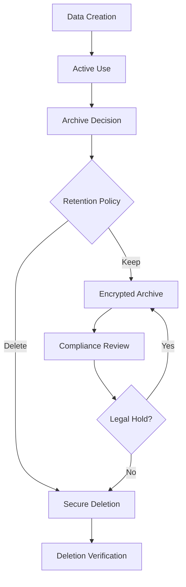

# 06. Data Management

*"Nothing real can be threatened. Nothing unreal exists. Herein lies the peace of God." — ACIM*

## Data Architecture Overview

ACIMguide's data architecture prioritizes spiritual privacy, data minimization, and reliability. We collect only what's necessary for the spiritual journey and protect it as sacred trust.

## Firestore Database Schema

### Collection Structure

```
acimguide-firestore/
├── users/
│   └── {userId}/
│       ├── profile: UserProfile
│       ├── settings: UserSettings
│       ├── messages/
│       │   └── {messageId}: Message
│       └── analytics/
│           └── {sessionId}: AnalyticsSession
├── threads/
│   └── {threadId}: Thread
├── system/
│   ├── config: SystemConfig
│   └── health: SystemHealth
└── content/
    ├── acim_quotes/
    │   └── {quoteId}: ACIMQuote
    └── daily_lessons/
        └── {lessonId}: DailyLesson
```

### Data Models

#### UserProfile
```typescript
interface UserProfile {
  userId: string;                    // Firebase Auth UID
  email?: string;                   // Optional, for communication
  displayName?: string;             // User's chosen name
  spiritualPreferences: {
    tone: "gentle" | "direct";      // Response style preference
    showCitations: boolean;         // Display ACIM references
    language: string;               // ISO 639-1 language code
  };
  onboarding: {
    completed: boolean;
    completedAt?: Timestamp;
    steps: string[];               // Completed onboarding steps
  };
  metadata: {
    createdAt: Timestamp;
    lastLoginAt: Timestamp;
    lastActiveAt: Timestamp;
    version: string;               // Profile schema version
  };
}
```

#### UserSettings
```typescript
interface UserSettings {
  userId: string;
  privacy: {
    analyticsEnabled: boolean;      // User consent for analytics
    messagePersistence: boolean;    // Store conversation history
    dataExportRequested?: Timestamp; // GDPR data export request
    dataDeletionRequested?: Timestamp; // Right to be forgotten
  };
  notifications: {
    dailyReflection: boolean;      // Daily spiritual reminders
    weeklyWisdom: boolean;         // Weekly ACIM insights
    pushEnabled: boolean;          // Mobile push notifications
  };
  accessibility: {
    fontSize: "small" | "medium" | "large" | "extra-large";
    highContrast: boolean;
    reduceMotion: boolean;
    screenReaderOptimized: boolean;
  };
  spiritual: {
    studyLevel: "beginner" | "intermediate" | "advanced";
    focusAreas: string[];          // Areas of spiritual interest
    customQuickActions: QuickAction[]; // Personalized spiritual prompts
  };
}
```

#### Message
```typescript
interface Message {
  messageId: string;
  userId: string;
  threadId: string;                // OpenAI thread reference
  conversation: {
    userMessage: string;           // User's spiritual question
    assistantResponse: string;     // CourseGPT's guidance
    citations?: Citation[];        // ACIM source references
  };
  metadata: {
    timestamp: Timestamp;
    latency: number;               // Response time in ms
    tokenUsage: {
      input: number;
      output: number;
    };
    tone: string;                  // Tone used for this response
    runId: string;                 // OpenAI run identifier
    status: "completed" | "failed" | "processing";
  };
  spiritual: {
    topics: string[];              // Extracted spiritual themes
    acimConcepts: string[];        // Referenced ACIM concepts
    emotionalTone: string;         // User's emotional state (if evident)
    guidanceType: "lesson" | "comfort" | "clarification" | "forgiveness";
  };
}
```

#### Thread
```typescript
interface Thread {
  threadId: string;                // OpenAI thread ID
  userId: string;
  title?: string;                  // User-assigned conversation title
  summary?: string;                // AI-generated conversation summary
  metadata: {
    createdAt: Timestamp;
    lastActiveAt: Timestamp;
    messageCount: number;
    totalTokens: number;
  };
  spiritual: {
    primaryTopics: string[];       // Main spiritual themes
    progressMarkers: string[];     // Spiritual growth indicators
    acimChaptersReferenced: string[]; // ACIM sections discussed
  };
}
```

#### Citation
```typescript
interface Citation {
  text: string;                    // Exact ACIM quote
  source: {
    book: "Text" | "Workbook" | "Manual" | "Clarification" | "Urtext";
    chapter?: number;
    section?: number;
    lesson?: number;
    page?: number;
    paragraph?: string;
  };
  context: string;                 // Surrounding context
  relevanceScore: number;          // 0-1 relevance to user's question
  verified: boolean;               // Quote accuracy verified
}
```

## Data Privacy & Protection

### Personal Identifiable Information (PII)

| Data Type | Classification | Storage | Encryption | Retention |
|-----------|---------------|---------|------------|-----------|
| **User ID** | PII | Firestore | At rest + transit | User lifetime |
| **Email** | PII | Firestore | At rest + transit | User lifetime |
| **Display Name** | PII | Firestore | At rest + transit | User lifetime |
| **Messages** | Sensitive | Firestore | At rest + transit | 7 years |
| **Usage Analytics** | Anonymous | Firestore | At rest + transit | 2 years |
| **Error Logs** | Technical | Cloud Logging | At rest + transit | 90 days |

### Data Minimization Principles

```
Data Collection Hierarchy:
1. Essential: Required for core spiritual guidance
   ├── User messages and responses
   ├── Basic user preferences
   └── Authentication data

2. Beneficial: Improves spiritual experience
   ├── Conversation history
   ├── Spiritual progress tracking
   └── Usage patterns for optimization

3. Optional: User-consented enhancements
   ├── Analytics data
   ├── Crash reporting
   └── Feature usage statistics

4. Prohibited: Never collected
   ├── Location data
   ├── Contact lists
   ├── Camera/microphone without permission
   └── Financial information
```

### Privacy by Design

| Principle | Implementation | Validation |
|-----------|----------------|------------|
| **Proactive not Reactive** | Privacy controls built into all features | Privacy impact assessments |
| **Privacy as Default** | Maximum privacy settings by default | User research validation |
| **Privacy Embedded** | No bolt-on privacy solutions | Architecture reviews |
| **Full Functionality** | Privacy doesn't compromise experience | User satisfaction metrics |
| **End-to-End Security** | Complete data lifecycle protection | Security audits |
| **Visibility & Transparency** | Clear privacy policies and controls | Legal compliance reviews |
| **Respect for Privacy** | User-centric privacy controls | User feedback integration |

## Data Retention & Lifecycle

### Retention Policies

| Data Category | Active Period | Archive Period | Deletion Trigger |
|---------------|---------------|----------------|------------------|
| **Active Messages** | Real-time access | 7 years | User deletion request |
| **User Profiles** | Account lifetime | 30 days post-deletion | Account termination |
| **Analytics Data** | 2 years | 1 year | Data minimization cycle |
| **System Logs** | 90 days | 1 year | Compliance requirements |
| **Backup Data** | 30 days | 1 year | Recovery requirements |
| **Cached Data** | Session lifetime | N/A | Session termination |

### Data Lifecycle Management



### Backup & Recovery Strategy

#### Backup Tiers

| Tier | Frequency | Retention | Recovery Time | Purpose |
|------|-----------|-----------|---------------|---------|
| **Hot Backup** | Real-time | 24 hours | < 1 minute | Active disaster recovery |
| **Warm Backup** | Every 6 hours | 7 days | < 30 minutes | Recent data recovery |
| **Cold Backup** | Daily | 90 days | < 4 hours | Historical data recovery |
| **Archive Backup** | Weekly | 7 years | < 24 hours | Compliance & long-term storage |

#### Recovery Scenarios

| Scenario | Recovery Time | Data Loss | Process |
|----------|---------------|-----------|---------|
| **Single Document Loss** | < 5 minutes | None | Point-in-time restore |
| **Collection Corruption** | < 30 minutes | < 6 hours | Warm backup restore |
| **Database Unavailable** | < 1 hour | < 24 hours | Cold backup restore |
| **Complete System Loss** | < 4 hours | < 7 days | Full archive restore |

## Data Quality & Integrity

### Data Validation Rules

| Field Type | Validation Rules | Error Handling |
|------------|------------------|----------------|
| **User Messages** | Length: 1-4000 chars, UTF-8 only | Gentle truncation message |
| **Email Addresses** | RFC 5322 compliance | Registration error feedback |
| **Timestamps** | ISO 8601 format | System-generated defaults |
| **User IDs** | Firebase UID format | Authentication failure |
| **ACIM Citations** | Source verification | Scholarly review flagging |

### Data Consistency

```typescript
// Firestore Transaction Example
async function createMessageWithAnalytics(
  userId: string, 
  message: Message,
  analyticsEvent: AnalyticsEvent
): Promise<void> {
  return firestore.runTransaction(async (transaction) => {
    // Ensure atomicity of related writes
    const messageRef = firestore.collection('users').doc(userId)
      .collection('messages').doc();
    const analyticsRef = firestore.collection('analytics').doc();
    const threadRef = firestore.collection('threads').doc(message.threadId);
    
    // Atomic writes
    transaction.set(messageRef, message);
    transaction.set(analyticsRef, analyticsEvent);
    transaction.update(threadRef, {
      lastActiveAt: FieldValue.serverTimestamp(),
      messageCount: FieldValue.increment(1)
    });
  });
}
```

## Security & Access Control

### Firestore Security Rules

```javascript
rules_version = '2';
service cloud.firestore {
  match /databases/{database}/documents {
    // User data access control
    match /users/{userId} {
      allow read, write: if request.auth != null 
        && request.auth.uid == userId;
      
      // Messages subcollection
      match /messages/{messageId} {
        allow read, write: if request.auth != null 
          && request.auth.uid == userId
          && resource.data.userId == userId;
      }
      
      // Analytics subcollection (write-only for privacy)
      match /analytics/{sessionId} {
        allow create: if request.auth != null 
          && request.auth.uid == userId;
        allow read: if false; // Privacy protection
      }
    }
    
    // Public read-only content
    match /content/{document=**} {
      allow read: if true;
      allow write: if false; // Admin-only writes
    }
    
    // System documents (admin-only)
    match /system/{document} {
      allow read, write: if request.auth != null 
        && request.auth.token.admin == true;
    }
  }
}
```

### Data Encryption

| Layer | Method | Key Management |
|-------|--------|----------------|
| **Transport** | TLS 1.3 | Google Cloud SSL |
| **Application** | AES-256 | Firebase default |
| **Database** | AES-256 | Google Cloud KMS |
| **Backups** | AES-256 | Google Cloud KMS |

## Analytics & Insights

### Spiritual Journey Analytics

```typescript
interface SpiritualAnalytics {
  userId: string; // Anonymized for privacy
  journey: {
    startDate: Timestamp;
    sessionsCount: number;
    averageSessionDuration: number;
    topicsExplored: string[];
    progressMarkers: string[];
  };
  engagement: {
    messagesPerSession: number;
    citationInteractions: number;
    quickActionsUsed: string[];
    returnFrequency: "daily" | "weekly" | "monthly" | "infrequent";
  };
  spiritual: {
    primaryConcerns: string[];
    growthAreas: string[];
    acimFamiliarity: "new" | "studying" | "advanced";
    transformationIndicators: string[];
  };
}
```

### Privacy-Preserving Analytics

1. **Data Anonymization**: No personally identifiable information
2. **Aggregation Only**: Individual patterns not tracked
3. **User Consent**: Explicit opt-in required
4. **Purpose Limitation**: Only for service improvement
5. **Regular Deletion**: Analytics data purged every 2 years

## Data Migration & Evolution

### Schema Versioning

```typescript
interface DataMigration {
  version: string;
  description: string;
  migration: (document: any) => Promise<any>;
  rollback: (document: any) => Promise<any>;
  validation: (document: any) => boolean;
}

// Example migration
const migration_1_0_to_1_1: DataMigration = {
  version: "1.1.0",
  description: "Add spiritual preferences to user profiles",
  migration: async (userProfile) => ({
    ...userProfile,
    spiritualPreferences: {
      tone: "gentle",
      showCitations: true,
      language: "en"
    }
  }),
  rollback: async (userProfile) => {
    const { spiritualPreferences, ...rest } = userProfile;
    return rest;
  },
  validation: (userProfile) => 
    userProfile.spiritualPreferences !== undefined
};
```

### Data Export (GDPR Compliance)

```typescript
interface DataExportRequest {
  userId: string;
  requestedAt: Timestamp;
  format: "json" | "csv";
  includeAnalytics: boolean;
  deliveryMethod: "email" | "download";
  status: "pending" | "processing" | "completed" | "failed";
  completedAt?: Timestamp;
  downloadUrl?: string; // Expires in 7 days
}

async function exportUserData(userId: string): Promise<UserDataExport> {
  return {
    profile: await getUserProfile(userId),
    messages: await getUserMessages(userId),
    settings: await getUserSettings(userId),
    analytics: await getUserAnalytics(userId), // If consented
    exportedAt: new Date().toISOString(),
    format: "JSON",
    version: "1.0"
  };
}
```

---

*"Your worth is not established by teaching or learning. Your worth is established by God."* — A Course in Miracles

This data management specification ensures that every byte of user data is treated with the reverence and protection that sacred spiritual conversations deserve.
