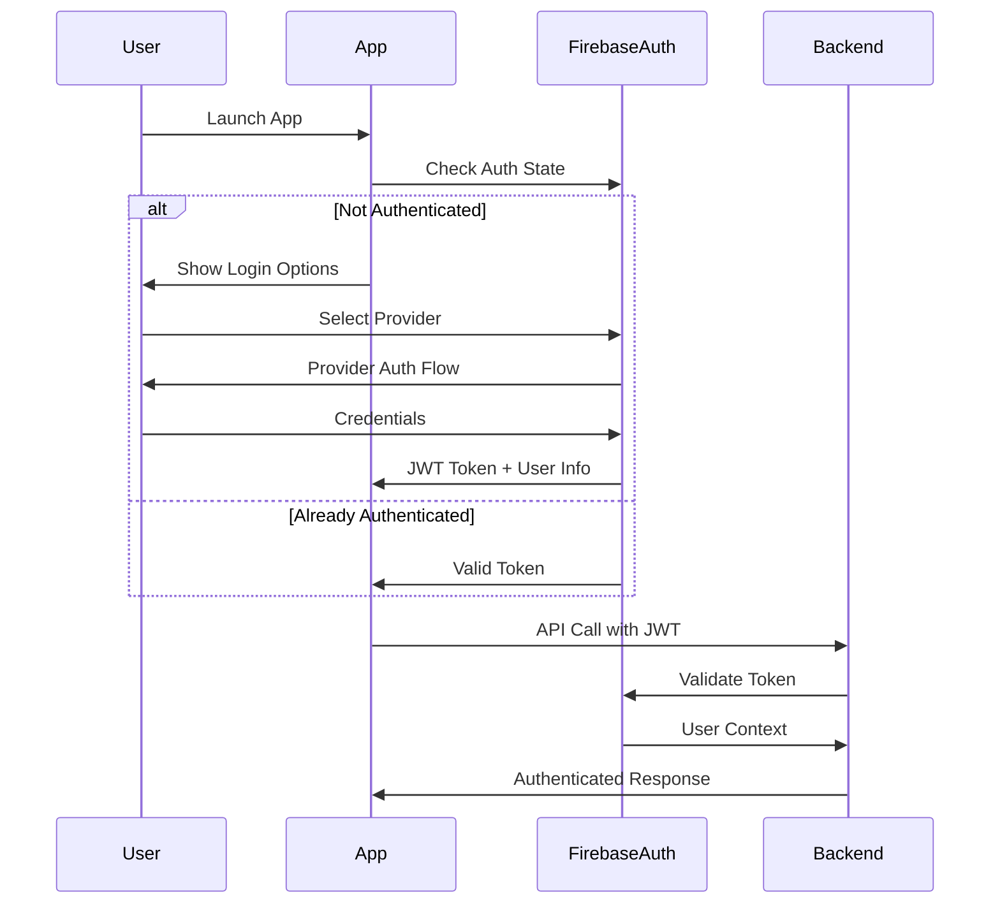
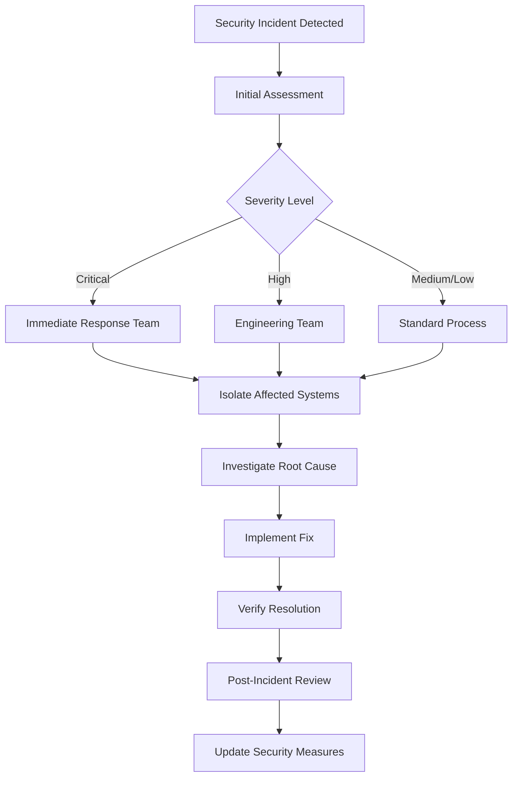

# 07. Security Framework

*"In my defenselessness my safety lies." — ACIM*

## Security Overview

ACIMguide's security framework protects users' intimate spiritual conversations while maintaining the openness that spiritual growth requires. We implement defense-in-depth strategies that secure without creating barriers to spiritual connection.

## Authentication & Identity Management

### Firebase Authentication Integration

| Provider | Implementation | Security Features |
|----------|----------------|-------------------|
| **Google OAuth** | Firebase Auth SDK | 2FA capable, secure tokens |
| **Apple Sign-In** | Firebase Auth SDK | Privacy-focused, minimal data |
| **Email/Password** | Firebase Auth SDK | Secure password policies |
| **Anonymous Auth** | Firebase Auth SDK | Spiritual exploration without commitment |

### Authentication Flow



### Token Management

| Token Type | Lifetime | Refresh Strategy | Security Measures |
|------------|----------|------------------|-------------------|
| **ID Token** | 1 hour | Automatic refresh | JWT signature verification |
| **Refresh Token** | 30 days | Secure storage | Device binding, rotation |
| **Custom Claims** | 1 hour | Admin-controlled | Role-based access control |

## Authorization Framework

### Role-Based Access Control (RBAC)

```typescript
interface UserRoles {
  // Standard user permissions
  user: {
    chat: boolean;           // Access to CourseGPT
    history: boolean;        // View own message history
    settings: boolean;       // Modify personal settings
    export: boolean;         // Export personal data
  };
  
  // Premium user permissions (future)
  premium: {
    advancedChat: boolean;   // Enhanced CourseGPT features
    analytics: boolean;      // Personal spiritual analytics
    customization: boolean;  // Advanced customization
  };
  
  // Content moderator permissions
  moderator: {
    reviewReports: boolean;  // Review user reports
    flagContent: boolean;    // Flag inappropriate content
  };
  
  // Administrative permissions
  admin: {
    userManagement: boolean; // Manage user accounts
    systemConfig: boolean;   // System configuration
    monitoring: boolean;     // Access system monitoring
  };
}
```

### Firestore Security Rules

```javascript
rules_version = '2';
service cloud.firestore {
  match /databases/{database}/documents {
    // Helper functions
    function isAuthenticated() {
      return request.auth != null;
    }
    
    function isOwner(userId) {
      return request.auth.uid == userId;
    }
    
    function hasRole(role) {
      return request.auth.token[role] == true;
    }
    
    // User data protection
    match /users/{userId} {
      allow read, write: if isAuthenticated() && isOwner(userId);
      
      match /messages/{messageId} {
        allow read, write: if isAuthenticated() && isOwner(userId);
        // Prevent modification of completed messages
        allow update: if resource.data.status != 'completed';
      }
      
      match /analytics/{sessionId} {
        // Write-only for privacy
        allow create: if isAuthenticated() && isOwner(userId);
        allow read: if hasRole('admin');
      }
    }
    
    // Content access control
    match /content/{document=**} {
      allow read: if true; // Public ACIM content
      allow write: if hasRole('admin');
    }
    
    // System administration
    match /system/{document=**} {
      allow read, write: if hasRole('admin');
    }
    
    // Moderation tools
    match /reports/{reportId} {
      allow create: if isAuthenticated();
      allow read, write: if hasRole('moderator') || hasRole('admin');
    }
  }
}
```

## Mobile Application Security (OWASP MSTG)

### M1: Improper Platform Usage

| Risk | Mitigation | Implementation |
|------|------------|----------------|
| **Keychain Misuse** | Proper keychain usage for sensitive data | Use Firebase Auth secure storage |
| **TouchID/FaceID** | Optional biometric authentication | Expo SecureStore with biometrics |
| **App Backgrounding** | Hide sensitive content when backgrounded | React Native AppState handling |

### M2: Insecure Data Storage

| Data Type | Storage Method | Encryption |
|-----------|----------------|------------|
| **Auth Tokens** | Firebase SDK secure storage | Platform keychain |
| **Message Cache** | React Native AsyncStorage (encrypted) | AES-256 |
| **User Preferences** | AsyncStorage (non-sensitive only) | None required |
| **Spiritual Content** | Local SQLite (read-only cache) | None (public domain) |

### M3: Insecure Communication

```typescript
// Network Security Configuration
const networkConfig = {
  // Enforce HTTPS only
  httpsOnly: true,
  
  // Certificate pinning for critical endpoints
  certificatePinning: {
    'api.openai.com': ['sha256/AAAAAAAAAAAAAAAAAAAAAAAAA='],
    'firebase.googleapis.com': ['sha256/BBBBBBBBBBBBBBBBBBBBBBBBB=']
  },
  
  // Disable HTTP caching for sensitive data
  cachePolicy: 'no-store-sensitive'
};
```

### M4: Insecure Authentication

| Authentication Factor | Implementation | Security Level |
|-----------------------|----------------|----------------|
| **Primary Auth** | Firebase Auth providers | High |
| **Biometric** | Device biometrics (optional) | High |
| **Device Binding** | Firebase device tokens | Medium |
| **Session Management** | JWT with automatic refresh | High |

### M5: Insufficient Cryptography

```typescript
// Encryption Standards
const encryptionConfig = {
  algorithms: {
    symmetric: 'AES-256-GCM',
    asymmetric: 'RSA-2048',
    hashing: 'SHA-256',
    keyDerivation: 'PBKDF2'
  },
  
  keyManagement: {
    storage: 'platform-keychain',
    rotation: '90-days',
    entropy: 'crypto-secure-random'
  }
};
```

### M6: Insecure Authorization

```typescript
// Client-side authorization checks (defense in depth)
class AuthorizationService {
  private userClaims: Record<string, boolean> = {};
  
  async checkPermission(action: string): Promise<boolean> {
    // Always verify with server for critical actions
    if (this.isCriticalAction(action)) {
      return await this.serverAuthCheck(action);
    }
    
    // Use cached claims for UI decisions only
    return this.userClaims[action] || false;
  }
  
  private isCriticalAction(action: string): boolean {
    return ['delete_account', 'export_data', 'modify_settings'].includes(action);
  }
}
```

### M7: Client Code Quality

| Quality Aspect | Tool/Process | Frequency |
|----------------|--------------|-----------|
| **Static Analysis** | ESLint + TypeScript | Every commit |
| **Dependency Scanning** | Snyk + npm audit | Weekly |
| **Code Review** | GitHub PR reviews | Every change |
| **Security Testing** | OWASP ZAP + manual testing | Monthly |

### M8: Code Tampering

```typescript
// Anti-tampering measures
const integrityChecks = {
  // Runtime Application Self-Protection (RASP)
  debuggerDetection: true,
  
  // Binary packing/obfuscation
  codeObfuscation: process.env.NODE_ENV === 'production',
  
  // Certificate/signature validation
  signatureVerification: true,
  
  // Environment validation
  environmentChecks: {
    rootDetection: true,
    emulatorDetection: true,
    hookingDetection: true
  }
};
```

### M9: Reverse Engineering

| Protection Method | Implementation | Effectiveness |
|-------------------|----------------|---------------|
| **Code Obfuscation** | Metro bundler + custom transforms | Medium |
| **String Encryption** | Runtime string decryption | Medium |
| **Control Flow** | Complex execution paths | Low |
| **API Key Protection** | Server-side proxy only | High |

### M10: Extraneous Functionality

```typescript
// Production build configuration
const productionConfig = {
  // Remove debug code
  debugMode: false,
  logging: 'error-only',
  
  // Disable development features
  devMode: false,
  testingEndpoints: false,
  debugMenus: false,
  
  // Minimize attack surface
  unusedDependencies: 'removed',
  testFiles: 'excluded'
};
```

## Cloud Security Framework

### Firebase Cloud Functions Security

```typescript
// Function-level security middleware
export const securityMiddleware = (requiredRole?: string) => {
  return async (req: CallableRequest, res: any, next: any) => {
    // Authentication check
    if (!req.auth) {
      throw new functions.https.HttpsError(
        'unauthenticated',
        'Authentication required for spiritual guidance'
      );
    }
    
    // Rate limiting
    await rateLimiter.check(req.auth.uid);
    
    // Role-based authorization
    if (requiredRole && !req.auth.token[requiredRole]) {
      throw new functions.https.HttpsError(
        'permission-denied',
        'Insufficient permissions for this spiritual service'
      );
    }
    
    // Input sanitization
    sanitizeInput(req.data);
    
    next();
  };
};
```

### Secret Management

| Secret Type | Storage Method | Access Control | Rotation |
|-------------|----------------|----------------|----------|
| **OpenAI API Keys** | Google Secret Manager | Functions only | 90 days |
| **Database Credentials** | Firebase Config | Automatic | Managed |
| **Encryption Keys** | Google Cloud KMS | Service accounts | 365 days |
| **Third-party API Keys** | Secret Manager | Principle of least privilege | 180 days |

## Incident Response Framework

### Security Incident Classification

| Severity | Examples | Response Time | Stakeholders |
|----------|----------|---------------|--------------|
| **Critical** | Data breach, authentication bypass | 15 minutes | All teams, legal |
| **High** | API vulnerability, privilege escalation | 1 hour | Engineering, security |
| **Medium** | Rate limiting bypass, information disclosure | 4 hours | Engineering team |
| **Low** | Minor configuration issues | 24 hours | Responsible engineer |

### Incident Response Process



### Data Breach Response

1. **Detection & Containment** (0-1 hour)
   - Identify scope of breach
   - Isolate affected systems
   - Preserve evidence

2. **Assessment & Notification** (1-24 hours)
   - Determine data categories affected
   - Assess user impact
   - Notify relevant authorities (GDPR: 72 hours)

3. **User Communication** (24-72 hours)
   - Draft clear, compassionate communication
   - Explain what happened and what we're doing
   - Provide actionable steps for users

4. **Recovery & Learning** (1-4 weeks)
   - Implement security improvements
   - Update policies and procedures
   - Conduct team training

## Compliance & Auditing

### Security Compliance Framework

| Standard | Scope | Frequency | Auditor |
|----------|-------|-----------|---------|
| **OWASP MSTG** | Mobile application | Quarterly | Internal + external |
| **GDPR** | Data protection | Annual | Legal compliance firm |
| **CCPA** | California privacy rights | Annual | Legal compliance firm |
| **SOC 2 Type 2** | Service organization controls | Annual | Certified auditor |

### Security Monitoring & Logging

```typescript
// Security event logging
interface SecurityEvent {
  eventType: 'authentication' | 'authorization' | 'data_access' | 'error';
  userId?: string;
  sessionId: string;
  endpoint: string;
  timestamp: Date;
  ipAddress: string; // Hashed for privacy
  userAgent: string;
  success: boolean;
  details: Record<string, any>;
}

// Anomaly detection
const securityMonitoring = {
  // Failed authentication attempts
  authFailures: {
    threshold: 5,
    timeWindow: '15m',
    action: 'temporary_block'
  },
  
  // Unusual API usage patterns
  apiAnomalies: {
    threshold: '3_std_dev',
    metric: 'requests_per_minute',
    action: 'alert_admin'
  },
  
  // Data access patterns
  dataAccess: {
    threshold: 'unusual_volume',
    timeWindow: '1h',
    action: 'require_reauth'
  }
};
```

## Spiritual Security Principles

### Protecting Sacred Conversations

1. **Confidentiality**: Conversations remain private and secure
2. **Integrity**: Messages cannot be altered or corrupted
3. **Availability**: Spiritual guidance available when needed
4. **Non-repudiation**: Users can trust the authenticity of responses
5. **Anonymity**: Option for anonymous spiritual exploration

### Ethical Security Practices

| Principle | Implementation | Validation |
|-----------|----------------|------------|
| **Minimal Surveillance** | Log only necessary security events | Privacy impact assessment |
| **Transparent Practices** | Clear security policy documentation | User feedback review |
| **Gentle Enforcement** | Security that doesn't disrupt spiritual flow | UX testing |
| **Trust Building** | Open communication about security measures | Community feedback |

---

*"The recognition of God is the recognition of yourself."* — A Course in Miracles

This security framework ensures that ACIMguide provides a safe, secure sanctuary for spiritual growth while maintaining the openness and accessibility that spiritual development requires.
