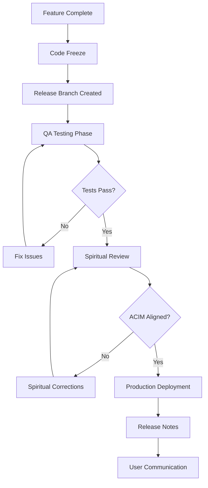

# 10. Governance & Standards

*"Order is a law of God. In the creation, God created order." — ACIM*

## Overview

This governance framework ensures that ACIMguide maintains spiritual integrity, technical excellence, and operational consistency as the project evolves. Every decision, process, and standard reflects our commitment to serving the spiritual needs of ACIM students with professional excellence.

## Development Governance

### Project Structure & Organization

```
ACIMguide Repository Structure:
├── specs/                          # Authoritative specifications
│   ├── 00-specifications-master.md
│   ├── 01-vision-and-principles.md
│   ├── 02-system-architecture.md
│   ├── 03-api-specifications.md
│   ├── 05-technical-requirements.md
│   ├── 06-data-management.md
│   ├── 07-security-framework.md
│   └── 10-governance.md
├── ACIMguide/                      # React Native mobile app
│   ├── src/
│   ├── package.json
│   └── app.json
├── functions/                      # Firebase Cloud Functions
│   ├── index.js
│   └── package.json
├── docs/                          # Project documentation
│   ├── README.md
│   ├── DEPLOYMENT.md
│   └── TESTING.md
├── .github/                       # GitHub workflows & templates
│   ├── workflows/
│   ├── ISSUE_TEMPLATE/
│   └── PULL_REQUEST_TEMPLATE.md
├── firebase.json
├── .gitignore
└── README.md
```

### Branching Strategy (GitFlow Adapted)

```
Branch Hierarchy:
├── main                    # Production-ready code
├── develop                 # Integration branch
├── release/vX.X.X         # Release preparation
├── feature/description    # New features
├── hotfix/description     # Emergency fixes
└── docs/description       # Documentation updates

Branch Protection Rules:
- main: Requires PR + 2 approvals + CI passing
- develop: Requires PR + 1 approval + CI passing
- Feature branches: No restrictions (encourage experimentation)
```

### Commit Convention (Conventional Commits)

```bash
# Format: <type>(<scope>): <description>

# Types:
feat: New feature for users
fix: Bug fix
docs: Documentation changes
style: Code style changes (formatting, etc.)
refactor: Code refactoring
test: Adding or updating tests
chore: Build process or auxiliary tool changes
spiritual: ACIM content or spiritual guidance updates

# Examples:
feat(chat): implement CourseGPT streaming responses
fix(auth): resolve Firebase token refresh issue
docs(api): update authentication flow documentation
spiritual(content): add new ACIM quote validation
test(e2e): add spiritual conversation flow tests
```

## Code Quality Standards

### TypeScript Configuration

```json
{
  "compilerOptions": {
    "strict": true,
    "noUncheckedIndexedAccess": true,
    "exactOptionalPropertyTypes": true,
    "noImplicitReturns": true,
    "noFallthroughCasesInSwitch": true,
    "noUncheckedIndexedAccess": true
  },
  "include": ["src/**/*"],
  "exclude": ["node_modules", "dist"]
}
```

### ESLint Configuration

```javascript
module.exports = {
  extends: [
    '@react-native',
    '@typescript-eslint/recommended',
    'plugin:react-hooks/recommended'
  ],
  rules: {
    // Spiritual code should be clear and readable
    'max-lines-per-function': ['warn', 50],
    'complexity': ['warn', 10],
    'max-depth': ['warn', 3],
    
    // ACIM principles in code
    'no-console': 'warn', // Gentle guidance, not strict prohibition
    'prefer-const': 'error', // Consistency and stability
    'no-unused-vars': 'error', // Simplicity and clarity
    
    // React Native specific
    'react-native/no-inline-styles': 'error',
    'react-hooks/exhaustive-deps': 'error'
  }
};
```

### Prettier Configuration

```json
{
  "semi": true,
  "trailingComma": "es5",
  "singleQuote": true,
  "printWidth": 80,
  "tabWidth": 2,
  "useTabs": false,
  "bracketSpacing": true,
  "jsxBracketSameLine": false,
  "arrowParens": "avoid"
}
```

## Code Review Process

### Review Guidelines

| Aspect | Criteria | Priority |
|--------|----------|----------|
| **Spiritual Alignment** | Code serves spiritual purpose | P0 |
| **ACIM Accuracy** | Any ACIM references are correct | P0 |
| **Security** | No security vulnerabilities | P0 |
| **Performance** | Meets performance requirements | P1 |
| **Maintainability** | Clear, readable, well-documented | P1 |
| **Testing** | Adequate test coverage | P2 |

### Pull Request Template

```markdown
## 🕊️ Spiritual Code Review Checklist

### Purpose
Brief description of what this change accomplishes for our users' spiritual journey.

### Changes Made
- [ ] Feature implementation
- [ ] Bug fix
- [ ] Documentation update
- [ ] Test coverage improvement

### Spiritual Alignment Review
- [ ] Changes align with ACIM principles
- [ ] User experience promotes inner peace
- [ ] No compromises to spiritual integrity

### Technical Review
- [ ] Code follows project standards
- [ ] Tests pass locally
- [ ] No security concerns
- [ ] Performance impact assessed

### Testing
- [ ] Unit tests added/updated
- [ ] Integration tests pass
- [ ] Manual testing completed
- [ ] Accessibility tested

### Documentation
- [ ] Code is self-documenting
- [ ] Complex logic has comments
- [ ] API changes documented
- [ ] README updated if needed

### Reviewer Notes
What should reviewers pay special attention to?

---
*"In the holy instant, God is remembered, and the language of communication with all your brothers is remembered with Him."* — ACIM
```

## Testing Standards

### Testing Pyramid

```
                    E2E Tests
                 /             \
            Integration Tests
         /                      \
    Unit Tests                   \
                              Manual Testing
```

### Test Coverage Requirements

| Test Type | Coverage Target | Tools | Frequency |
|-----------|----------------|-------|-----------|
| **Unit Tests** | ≥ 80% | Jest, React Native Testing Library | Every commit |
| **Integration Tests** | ≥ 70% | Detox, Firebase Test SDK | Every PR |
| **E2E Tests** | Core user flows | Detox, Expo | Daily |
| **Performance Tests** | Key metrics | Firebase Performance | Weekly |
| **Security Tests** | OWASP checks | Snyk, manual testing | Monthly |

### Test Organization

```typescript
// Test naming convention
describe('ChatService', () => {
  describe('sendMessage', () => {
    it('should send spiritual question to CourseGPT', async () => {
      // Arrange: Set up spiritual conversation context
      const spiritualQuestion = "How can I practice forgiveness?";
      
      // Act: Send message with love
      const response = await chatService.sendMessage(spiritualQuestion);
      
      // Assert: Verify ACIM-aligned response
      expect(response).toHaveACIMGuidance();
      expect(response.tone).toBe('gentle');
    });
    
    it('should handle API errors with grace', async () => {
      // Test error handling that maintains spiritual experience
    });
  });
});
```

## Documentation Standards

### Documentation Hierarchy

| Document Type | Audience | Update Frequency | Format |
|---------------|----------|------------------|--------|
| **Specifications** | All stakeholders | Quarterly | Markdown |
| **API Documentation** | Developers | Every API change | OpenAPI/Swagger |
| **User Guides** | ACIM students | As needed | Markdown + screenshots |
| **Architecture Decisions** | Technical team | Per decision | ADR format |
| **Deployment Guides** | DevOps team | Every release | Markdown |

### Architecture Decision Records (ADR)

```markdown
# ADR-001: CourseGPT Integration Approach

## Status
Accepted

## Context
We need to integrate with OpenAI to provide ACIM-specific spiritual guidance while maintaining accuracy and spiritual integrity.

## Decision
We will use OpenAI's Assistants API with a custom CourseGPT assistant trained exclusively on ACIM materials.

## Rationale
- **Spiritual Accuracy**: Custom training ensures ACIM fidelity
- **Citation Support**: Vector store enables exact quotations
- **Scalability**: OpenAI handles infrastructure scaling
- **Cost Efficiency**: Pay-per-use model aligns with growth

## Consequences
- **Positive**: Accurate ACIM guidance, scalable infrastructure
- **Negative**: Dependency on third-party service, ongoing costs
- **Mitigation**: Implement fallback mechanisms, monitor usage

## Implementation Notes
- Environment-specific assistant IDs
- Rate limiting to manage costs
- Comprehensive error handling for service outages

---
*Date: 2025-08-23*
*Reviewers: Technical Team, Spiritual Advisory Board*
```

## Release Management

### Semantic Versioning Strategy

```
Version Format: MAJOR.MINOR.PATCH

MAJOR: Breaking changes or major spiritual guidance improvements
MINOR: New features that maintain backward compatibility  
PATCH: Bug fixes and minor improvements

Examples:
1.0.0: Initial MVP release
1.1.0: Add multilingual support
1.1.1: Fix authentication bug
2.0.0: Major UX redesign
```

### Release Process



### Release Criteria

| Category | Criteria | Verification Method |
|----------|----------|-------------------|
| **Functionality** | All features work as specified | Manual testing |
| **Performance** | Meets SLA requirements | Load testing |
| **Security** | No critical vulnerabilities | Security scan |
| **Spiritual Quality** | ACIM accuracy verified | Spiritual advisory review |
| **User Experience** | Intuitive and peaceful | User acceptance testing |

## Quality Assurance

### Definition of Done

A feature is considered "done" when:

- [ ] **Code Quality**: Passes all linting and formatting checks
- [ ] **Tests**: Unit tests ≥80%, integration tests pass
- [ ] **Security**: Security review completed, no high-risk issues
- [ ] **Performance**: Meets performance requirements
- [ ] **Documentation**: Code documented, user docs updated
- [ ] **Spiritual Review**: Aligns with ACIM principles
- [ ] **Accessibility**: WCAG 2.1 AA compliance verified
- [ ] **Cross-Platform**: Works on Android (iOS future)
- [ ] **Review**: Code review completed and approved

### Continuous Integration Checks

```yaml
# .github/workflows/ci.yml
name: Spiritual Development CI

on: [push, pull_request]

jobs:
  spiritual-code-quality:
    runs-on: ubuntu-latest
    steps:
      - name: Checkout with Love
        uses: actions/checkout@v4
        
      - name: Setup Sacred Environment
        uses: actions/setup-node@v4
        with:
          node-version: '18'
          
      - name: Install Dependencies with Care
        run: npm install
        
      - name: Lint for Spiritual Clarity
        run: npm run lint
        
      - name: Test with Compassion
        run: npm run test:coverage
        
      - name: Build with Purpose
        run: npm run build
        
      - name: Security Scan
        run: npm audit --audit-level=high
```

## Change Management

### Change Types & Approval Process

| Change Type | Examples | Required Approvals | Process |
|-------------|----------|-------------------|---------|
| **Spiritual Content** | ACIM quotes, guidance tone | Spiritual Advisory Board | Scholarly review |
| **Major Features** | New core functionality | Product + Technical Lead | RFC process |
| **API Changes** | Breaking API modifications | Technical Lead + API Review | Deprecation timeline |
| **Security Updates** | Critical security patches | Security Team | Expedited review |
| **Bug Fixes** | Non-breaking corrections | Code Review | Standard PR process |

### Configuration Management

```typescript
// Environment configuration
interface EnvironmentConfig {
  development: {
    openai: {
      assistantId: string;
      vectorStoreId: string;
    };
    firebase: {
      projectId: 'acimguide-dev';
      region: 'us-central1';
    };
    debugging: {
      enabled: true;
      logLevel: 'debug';
    };
  };
  
  production: {
    openai: {
      assistantId: string; // From secret management
      vectorStoreId: string;
    };
    firebase: {
      projectId: 'acimguide';
      region: 'us-central1';
    };
    debugging: {
      enabled: false;
      logLevel: 'error';
    };
  };
}
```

## Spiritual Advisory Board

### Composition
- **ACIM Scholar** (PhD in Religious Studies)
- **Experienced ACIM Teacher** (20+ years)
- **Clinical Psychologist** (ACIM-informed therapy)
- **Technical Ethicist** (AI ethics specialist)

### Responsibilities
1. **Content Review**: Verify all ACIM references and spiritual guidance
2. **Ethical Oversight**: Ensure technology serves spiritual growth
3. **User Experience**: Assess spiritual impact of design decisions
4. **Policy Guidance**: Advise on spiritual and ethical policies

### Review Process
- **Monthly Reviews**: Regular assessment of spiritual alignment
- **Feature Reviews**: New spiritual features before implementation
- **Incident Response**: Guidance on spiritual/ethical issues
- **Annual Assessment**: Comprehensive review of spiritual mission adherence

---

*"The only meaningful prayer is for forgiveness, because those who have been forgiven have everything."* — A Course in Miracles

This governance framework ensures that ACIMguide maintains its spiritual mission while achieving technical excellence, creating a sustainable foundation for serving the global ACIM community with love, wisdom, and professional integrity.
